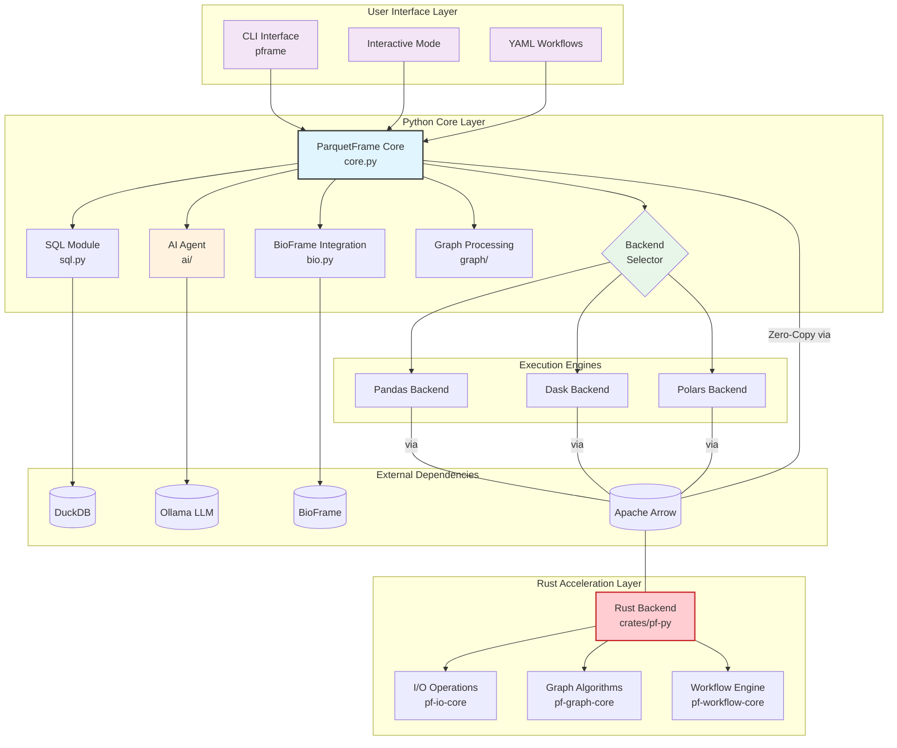

# ParquetFrame Architecture Diagram

## Architecture Summary

The `parquetframe` architecture is a multi-layer system designed for high-performance, flexible data manipulation, with a Python core and a Rust acceleration layer.

### 1. User Interface Layer
- **CLI (`pframe`)**: A powerful command-line interface for batch processing, data exploration, and executing workflows.
- **Interactive Mode**: A REPL environment for exploratory analysis, including AI-powered natural language queries.
- **YAML Workflows**: A declarative way to define and execute complex data processing pipelines.

### 2. Python Core Layer
- **ParquetFrame Core (`core.py`)**: The central DataFrame wrapper that provides a unified API.
- **Backend Selector**: An intelligent, memory-aware component that automatically selects the most appropriate execution engine (Pandas, Dask, or Polars) based on the workload and data size.
- **Feature Modules**:
    - **SQL Module**: Integrates `DuckDB` to allow SQL queries directly on DataFrames.
    - **BioFrame Integration**: Provides specialized, parallelized operations for genomic interval data.
    - **Graph Processing**: Manages graph data structures, leveraging the Rust backend for high-performance algorithm execution.
    - **AI Agent**: Connects to local LLMs (via `Ollama`) to translate natural language questions into executable queries.

### 3. Execution Engines
- **Pandas**: For small, in-memory datasets.
- **Dask**: For large, out-of-core datasets that require parallel processing.
- **Polars**: A high-performance, Rust-based engine for efficient data manipulation.
The Backend Selector dynamically chooses the best engine for the task, providing optimal performance without user intervention.

### 4. Rust Acceleration Layer
This layer provides significant performance speedups for computationally intensive tasks. It is written in Rust and interfaces with the Python layer via Apache Arrow for zero-copy data transfer.
- **Rust Backend (`pf-py`)**: The main entry point that exposes Rust functionality to Python.
- **I/O Operations (`pf-io-core`)**: Accelerates metadata reading, row counts, and other I/O-bound tasks.
- **Graph Algorithms (`pf-graph-core`)**: High-performance implementations of common graph algorithms (e.g., PageRank, BFS).
- **Workflow Engine (`pf-workflow-core`)**: A Rust-powered engine for executing `parquetframe` workflows with enhanced speed.

### 5. Data Flow and Interoperability
- **Apache Arrow**: Acts as the central nervous system for data. It provides a standardized, zero-copy memory format that allows seamless and efficient data sharing between the Python execution engines (Pandas, Dask, Polars) and the Rust backend. This eliminates serialization overhead and is key to the library's performance.
