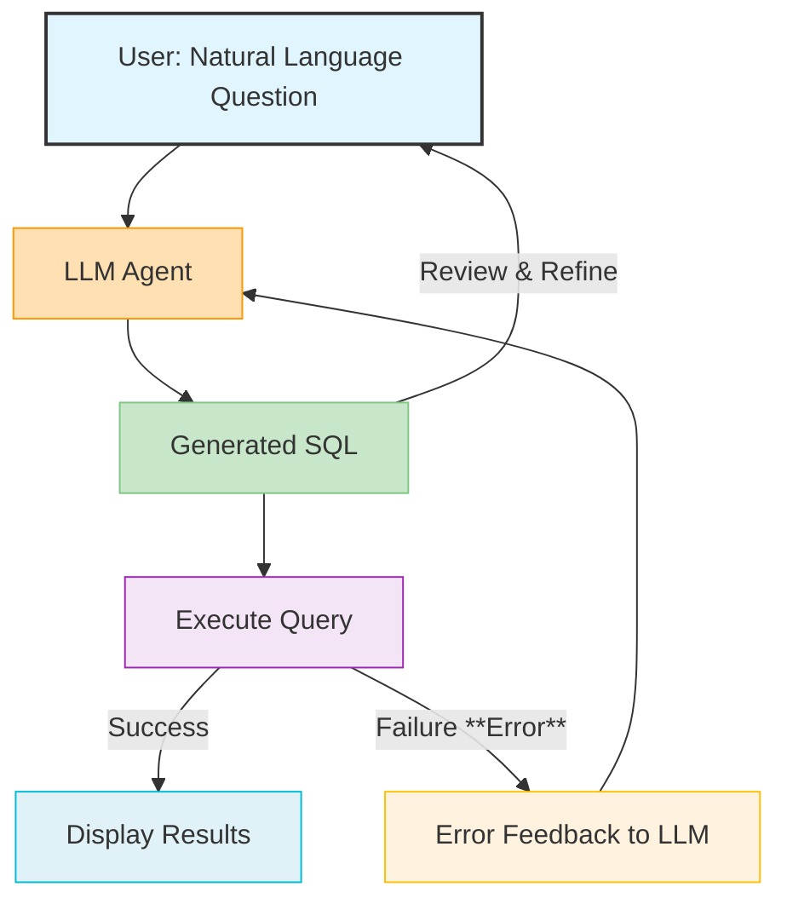

# Prompt Engineering

## Overview

Prompt engineering is the art and science of crafting effective inputs (prompts) for Large Language Models (LLMs) to achieve desired outputs. In the context of ParquetFrame's AI features, this means formulating natural language questions that guide the LLM to generate accurate and executable SQL queries or DataFrame operations. Mastering prompt engineering allows you to unlock the full potential of AI-powered data exploration, transforming complex analytical tasks into intuitive conversations.

## Key Principles of Prompt Engineering for ParquetFrame

Effective prompts for ParquetFrame's AI agent adhere to several core principles:

### 1. Clarity and Specificity

Use clear, unambiguous language. Avoid vague terms and be as specific as possible about what you want to achieve.

*   **Good**: "Show me the total sales amount for products in the 'Electronics' category last month."
*   **Bad**: "Show me some sales data."

### 2. Schema Awareness

The LLM agent is provided with your data schema (table names, column names, data types). Leverage this knowledge in your prompts.

*   **Good**: "Calculate the average `order_value` for `customers` from `California`."
*   **Bad**: "What's the average price for people in California?" (if `order_value` is the column name, not `price`)

### 3. Contextual Information

Provide all necessary contextual information within your prompt, such as timeframes, specific metrics, or conditions.

*   **Good**: "What was the `revenue` generated by `product_id` 123 in `Q3 2024`?"
*   **Bad**: "What was the revenue for product 123?"

### 4. Iterative Refinement

Treat prompt engineering as an iterative process. If the initial generated query isn't what you expected, refine your prompt based on the LLM's response or any execution errors.



## Prompt Templates and Examples

Here are some effective prompt structures and examples for common data analysis tasks:

### 1. Aggregation and Grouping

**Template**: "Show me the [aggregation] of [metric] by [dimension] [timeframe/condition]."

*   **Example**: "Calculate the `sum` of `amount` by `customer_id` for `orders` placed `last month`."
*   **Example**: "What is the `average` `price` of `products` in each `category`?"

### 2. Filtering and Selection

**Template**: "Find all [entities] where [condition] [and/or condition]."

*   **Example**: "Show me all `customers` who live in `New York` and have `age` greater than `30`."
*   **Example**: "List `products` that are `out of stock`."

### 3. Trend Analysis

**Template**: "Show me the [metric] trend [over time period] by [dimension]."

*   **Example**: "What is the `monthly sales trend` for `product_id` 456 `over the last year`?"
*   **Example**: "Display the `daily active users` count for the `past 90 days`."

### 4. Ranking and Limiting

**Template**: "Show me the `top N` [metric] by [dimension]."

*   **Example**: "List the `top 10` `customers` by `total_spent`."
*   **Example**: "Which `products` have the `lowest 5` `profit_margins`?"

### 5. Joining and Relationships (with `DataContext`)

When using a `DataContext` with multiple tables, the LLM can infer joins.

*   **Example**: "Show me the `names` of `customers` who bought `product` 'Laptop Pro'." (Assumes `customers` and `products` tables can be joined via an `orders` table).

## Context Optimization Techniques

ParquetFrame provides several ways to optimize the context provided to the LLM, improving accuracy and efficiency.

### 1. Multi-Step Reasoning (`use_multi_step`)

For complex schemas with many tables, enabling multi-step reasoning helps the LLM focus on relevant information.

```python
agent = LLMAgent(use_multi_step=True)
# The agent first identifies relevant tables, then generates SQL.
```

### 2. Custom Examples (`add_custom_example`)

Provide domain-specific examples to teach the LLM how to handle particular query patterns or terminology.

```python
agent.add_custom_example(
    question="show me high value customers",
    sql="SELECT customer_id, total_spent FROM customers WHERE total_spent > 10000 ORDER BY total_spent DESC"
)
```

### 3. Temperature and Max Retries

*   **`temperature`**: Controls the randomness of the LLM's output. Lower values (e.g., 0.0-0.1) lead to more deterministic and focused SQL generation, ideal for production. Higher values (e.g., 0.2-0.5) can be useful for exploratory analysis where more creative interpretations are desired.
*   **`max_retries`**: Configures the number of times the LLM will attempt to self-correct a failed query. A higher number increases resilience but can increase latency.

## Handling Complex Queries

For very complex analytical questions, it's often more effective to break them down into smaller, manageable steps:

1.  **Decompose**: Break the complex question into a series of simpler questions.
2.  **Iterate**: Generate and execute queries for each sub-question sequentially.
3.  **Combine**: Use ParquetFrame's DataFrame operations to combine the results of the sub-queries.

## Troubleshooting Common Issues

*   **Incorrect Column/Table Names**: Double-check your schema using `\describe <table>` in the CLI. Ensure your prompt uses the exact names.
*   **Ambiguous Questions**: If the LLM generates an unexpected query, try to rephrase your question with more specific details or constraints.
*   **Syntax Errors**: If the generated SQL has syntax errors, the self-correction mechanism should kick in. If it persists, simplify the prompt or provide custom examples.
*   **Performance Issues**: Refer to the [Performance Guide](../performance.md) and [Troubleshooting section in Natural Language Queries](./nl-queries.md#troubleshooting) for tips on optimizing LLM performance and query execution.

## Related Documentation

*   [AI Features Overview](./overview.md) - General introduction to ParquetFrame's AI capabilities.
*   [Natural Language Queries](./nl-queries.md) - Detailed guide on using NL queries.
*   [Local LLM Setup](./setup.md) - Instructions for setting up Ollama and LLMs.
