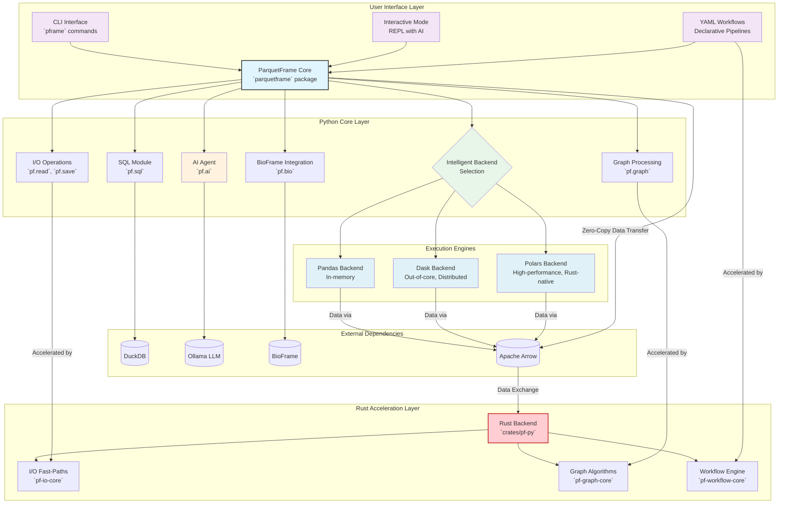

# ParquetFrame Architecture

## Overview

ParquetFrame is a high-performance, AI-powered data exploration and analysis platform designed to unlock the full potential of dataframes. Its architecture is built around a flexible Python core, enhanced by a powerful Rust acceleration layer, and an intelligent multi-engine execution strategy. This design ensures optimal performance, scalability, and ease of use across various data workloads.

## Core Architectural Principles

*   **Intelligent Backend Selection**: Dynamically chooses the best execution engine (Pandas, Dask, Polars) based on data size, workload characteristics, and available resources.
*   **Rust Acceleration**: Offloads performance-critical operations (I/O, graph algorithms, workflow execution) to a highly optimized Rust backend for significant speedups.
*   **Zero-Copy Interoperability**: Leverages Apache Arrow for efficient, zero-copy data transfer between Python and Rust components, minimizing overhead.
*   **AI-Powered Data Exploration**: Integrates local Large Language Models (LLMs) for natural language to query conversion, enhancing accessibility and user experience.
*   **Unified API**: Provides a consistent and intuitive Python API regardless of the underlying execution engine or acceleration layer.

## Architecture Diagram

## Component Breakdown

### 1. User Interface Layer

This layer provides various entry points for users to interact with ParquetFrame.

*   **CLI Interface (`pframe`)**: A robust command-line interface offering commands for data inspection (`info`), batch processing (`run`), SQL queries (`sql`), AI-powered natural language queries (`query`), and workflow execution (`workflow`).
*   **Interactive Mode**: A rich REPL (Read-Eval-Print Loop) environment for exploratory data analysis. It supports direct Python code execution, meta-commands, and seamless integration with the AI Agent for natural language queries.
*   **YAML Workflows**: Enables users to define complex, multi-step data processing pipelines using a declarative YAML syntax. These workflows can leverage the full power of ParquetFrame, including Rust acceleration.

### 2. Python Core Layer

The heart of ParquetFrame, written in Python, orchestrates operations and provides the unified API.

*   **ParquetFrame Core (`parquetframe` package)**: The central DataFrame wrapper that abstracts away the complexities of different backends and acceleration layers. It provides a consistent API for data manipulation, transformation, and analysis.
*   **Intelligent Backend Selection**: This crucial component dynamically assesses the workload, data size, and system resources to choose the most appropriate execution engine:
    *   **Pandas**: Optimized for smaller, in-memory datasets.
    *   **Dask**: Ideal for large, out-of-core datasets and distributed computing, enabling parallel processing.
    *   **Polars**: A high-performance, Rust-native DataFrame library that offers significant speedups for many operations, especially on single-node, multi-core systems.
*   **SQL Module (`pf.sql`)**: Integrates with `DuckDB` to allow users to execute SQL queries directly on DataFrames, supporting complex joins and aggregations.
*   **BioFrame Integration (`pf.bio`)**: Provides specialized functionalities for genomic interval operations, often leveraging Dask for parallel processing of large biological datasets.
*   **Graph Processing (`pf.graph`)**: Offers tools for working with graph data structures, with performance-critical algorithms offloaded to the Rust acceleration layer.
*   **AI Agent (`pf.ai`)**: Facilitates natural language interaction by translating user questions into executable queries (e.g., SQL, DataFrame operations) using local LLMs (e.g., Ollama).
*   **I/O Operations (`pf.read`, `pf.save`)**: Handles reading and writing data in various formats (Parquet, CSV, JSON, ORC, etc.), with performance-critical paths accelerated by the Rust backend.

### 3. Rust Acceleration Layer

This layer is implemented in Rust and provides significant performance enhancements for computationally intensive tasks. It communicates with the Python core via Apache Arrow for efficient data exchange.

*   **Rust Backend (`crates/pf-py`)**: The primary interface between the Python core and the Rust-implemented functionalities, using `PyO3` for seamless binding.
*   **I/O Fast-Paths (`pf-io-core`)**: Accelerates operations like Parquet metadata reading, row counting, and column statistics extraction, often achieving 5-10x speedups.
*   **Graph Algorithms (`pf-graph-core`)**: Provides highly optimized implementations of graph algorithms such as PageRank, Breadth-First Search (BFS), and shortest path calculations, offering 15-25x speedups.
*   **Workflow Engine (`pf-workflow-core`)**: Enhances the execution of YAML-defined data pipelines with parallel processing and resource-aware scheduling, leading to 10-15x speedups.

### 4. External Dependencies

ParquetFrame integrates with several powerful external libraries to deliver its features.

*   **DuckDB**: An in-process SQL OLAP database used for high-performance SQL query execution on DataFrames.
*   **Ollama LLM**: A local Large Language Model provider used by the AI Agent for privacy-preserving natural language processing.
*   **BioFrame**: A Python library for genomic interval operations, integrated for specialized biological data analysis.
*   **Apache Arrow**: A language-agnostic columnar memory format that enables zero-copy data sharing between Python (Pandas, Dask, Polars) and Rust, which is fundamental to ParquetFrame's performance.

## Data Flow and Interoperability

Apache Arrow plays a pivotal role in ParquetFrame's architecture by providing a universal, high-performance data interchange format. Data from various sources is loaded into Arrow-compatible structures, allowing for efficient, zero-copy transfers between Python execution engines (Pandas, Dask, Polars) and the Rust acceleration layer. This design minimizes serialization/deserialization overhead, which is a common bottleneck in polyglot systems, and ensures maximum performance.

## Performance Considerations

ParquetFrame is engineered for performance from the ground up:

*   **Lazy Evaluation**: Dask and Polars backends support lazy evaluation, deferring computations until results are needed, which is crucial for large datasets.
*   **Predicate Pushdown**: Filters are applied as early as possible, often at the file reading stage, to reduce the amount of data processed.
*   **Column Pruning**: Only necessary columns are read from storage, minimizing I/O.
*   **Rust-Accelerated Operations**: Critical I/O, graph, and workflow tasks are offloaded to highly optimized Rust code.
*   **Zero-Copy Data Transfer**: Apache Arrow ensures efficient data movement between components without costly memory copies.
*   **Intelligent Backend Switching**: The system automatically adapts to the data size and workload, choosing the most efficient backend for the task.

## Future Extensions

ParquetFrame is continuously evolving, with planned features including:

*   **Cloud Storage Integration**: Seamless support for S3, GCS, Azure Blob Storage.
*   **Advanced Workflow Orchestration**: More sophisticated tools for managing complex data pipelines.
*   **Real-time Monitoring**: Live dashboards for tracking query execution and resource utilization.
*   **Integrated Visualizations**: Built-in plotting capabilities for quick data insights.

## Security & Privacy

ParquetFrame prioritizes data security and privacy:

*   **Local LLM Integration**: By using local LLMs like Ollama, sensitive data remains on the user's machine, ensuring privacy.
*   **Secure Connections**: Support for encrypted database connections and secure credential management.
*   **Audit Logging**: Comprehensive logging of queries and access for compliance and debugging.
*   **Schema-Only AI Interaction**: Only schema information (not actual data) is typically sent to the LLM for query generation, further protecting data privacy.
