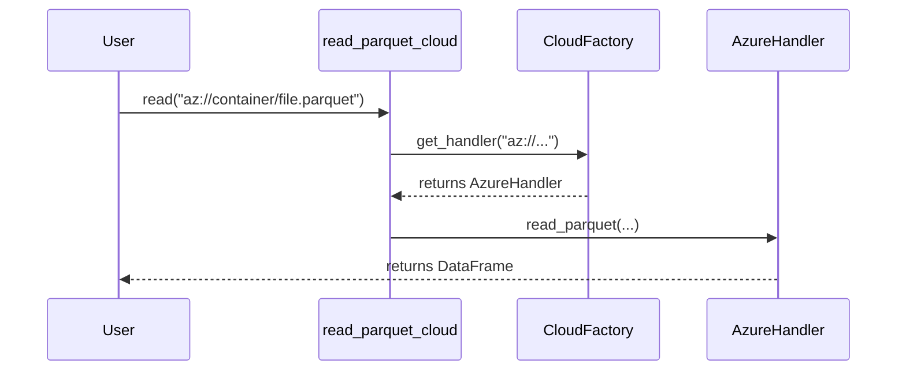

# Azure Blob Storage Integration

ParquetFrame provides seamless integration with Azure Blob Storage (ABS) and Azure Data Lake Gen2.

## Prerequisites

Install the required dependency:

```bash
pip install adlfs
```

## Configuration

ParquetFrame supports multiple authentication methods for Azure.

### Environment Variables

Set the following environment variables as needed:

- `AZURE_STORAGE_CONNECTION_STRING`: Full connection string.
- `AZURE_STORAGE_ACCOUNT_NAME`: Storage account name.
- `AZURE_STORAGE_ACCOUNT_KEY`: Storage account key.
- `AZURE_STORAGE_SAS_TOKEN`: Shared Access Signature token.

### Explicit Configuration

```python
from parquetframe.cloud import AzureConfig

# Using Connection String
config = AzureConfig(connection_string="DefaultEndpointsProtocol=https;...")

# Using Account Key
config = AzureConfig(
    account_name="myaccount",
    account_key="mykey"
)
```

## Usage

Use `az://`, `abfs://`, or `abfss://` URI schemes.



### Reading Data

```python
from parquetframe.cloud import read_parquet_cloud

# Read from Blob Storage
df = read_parquet_cloud("az://my-container/data.parquet")

# Read from Data Lake Gen2
df = read_parquet_cloud("abfs://my-container/data.parquet")
```

### Writing Data

```python
from parquetframe.cloud import write_parquet_cloud

# Write DataFrame
write_parquet_cloud(df, "az://my-container/output.parquet")
```
