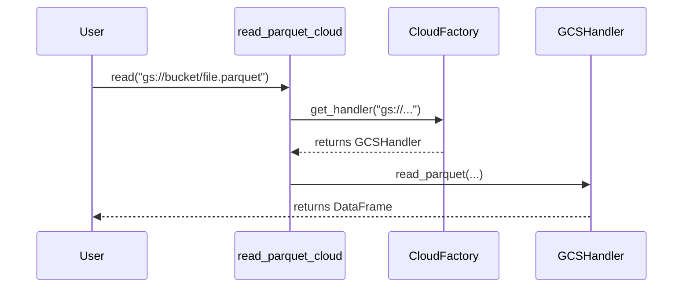

# Google Cloud Storage Integration

ParquetFrame provides seamless integration with Google Cloud Storage (GCS) for reading and writing Parquet files.

## Prerequisites

Install the required dependency:

```bash
pip install gcsfs
```

## Configuration

ParquetFrame automatically detects GCS credentials from your environment.

### Environment Variables

The standard Google Cloud environment variables are supported:

- `GOOGLE_APPLICATION_CREDENTIALS`: Path to your service account JSON key file.
- `GCP_PROJECT` or `GOOGLE_CLOUD_PROJECT`: Your Google Cloud project ID.

### Explicit Configuration

You can also configure GCS explicitly:

```python
from parquetframe.cloud import GCSConfig, read_parquet_cloud

# Explicit config
config = GCSConfig(
    project="my-project",
    token="/path/to/key.json"
)

# Pass config to handler (advanced usage)
# For standard usage, environment variables are recommended.
```

## Usage

Simply use the `gs://` URI scheme with `read_parquet_cloud` or `write_parquet_cloud`.



### Reading Data

```python
from parquetframe.cloud import read_parquet_cloud

# Read into Pandas (default)
df = read_parquet_cloud("gs://my-bucket/data.parquet")

# Read into Polars
pl_df = read_parquet_cloud("gs://my-bucket/data.parquet", backend="polars")

# Read into Dask
ddf = read_parquet_cloud("gs://my-bucket/data.parquet", backend="dask")
```

### Writing Data

```python
from parquetframe.cloud import write_parquet_cloud

# Write Pandas DataFrame
write_parquet_cloud(df, "gs://my-bucket/output.parquet")

# Write Polars DataFrame
write_parquet_cloud(pl_df, "gs://my-bucket/output.parquet")
```
