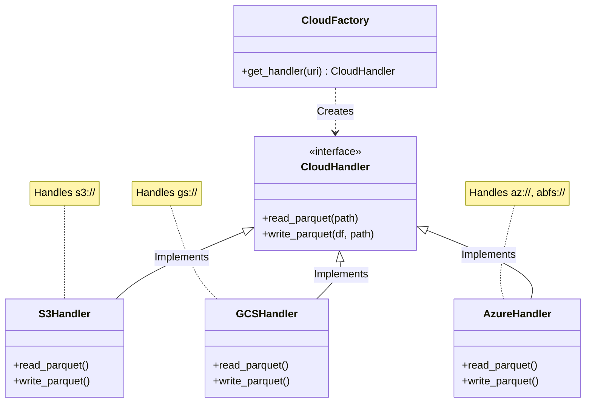

# Cloud Integration Overview

ParquetFrame provides a unified, extensible architecture for interacting with major cloud providers.

## Architecture

The system uses a **Factory Pattern** to automatically select the appropriate handler based on the URI scheme.



## Supported Providers

| Provider | URI Scheme | Backend Library |
|----------|------------|-----------------|
| **AWS S3** | `s3://` | `s3fs` / Rust |
| **Google Cloud** | `gs://` | `gcsfs` |
| **Azure Blob** | `az://`, `abfs://` | `adlfs` |

## Unified API

You don't need to instantiate handlers manually. Just use the top-level functions:

```python
from parquetframe.cloud import read_parquet_cloud

# The factory handles the rest!
df = read_parquet_cloud("gs://my-bucket/data.parquet")
```
