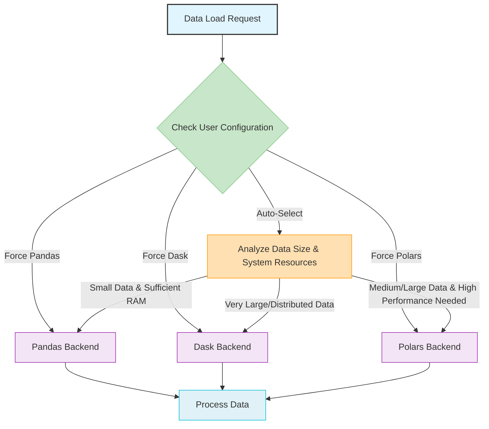

# Multi-Engine Support

> ParquetFrame intelligently selects and seamlessly integrates with multiple processing backends to optimize performance and scalability for diverse data workloads.

## Overview

ParquetFrame is designed to unlock the power of dataframes by providing a flexible and high-performance processing engine. It achieves this by supporting multiple backend engines: **Pandas**, **Dask**, and **Polars**. This multi-engine approach allows ParquetFrame to adapt to various data sizes, computational requirements, and system resources, ensuring optimal performance whether you're working with small, in-memory datasets or massive, out-of-core data.

## Available Backends

### 1. Pandas Backend

*   **Best for**: Small to medium-sized datasets that fit comfortably in memory (typically < 1GB).
*   **Characteristics**: Offers a rich and mature API, widely adopted in the Python data science ecosystem. Highly optimized for single-machine, in-memory operations.
*   **Use Cases**: Interactive data analysis, rapid prototyping, operations on smaller data subsets.

### 2. Dask Backend

*   **Best for**: Large datasets that exceed available memory or require distributed processing.
*   **Characteristics**: Provides parallel computing capabilities, allowing operations to be performed out-of-core and potentially across multiple machines. Integrates well with other Dask components for distributed computing.
*   **Use Cases**: Processing terabyte-scale datasets, complex ETL pipelines, distributed machine learning.

### 3. Polars Backend

*   **Best for**: High-performance, memory-efficient operations on single-node, multi-core systems, especially for medium to large datasets.
*   **Characteristics**: A DataFrame library written in Rust, known for its blazing-fast execution speed, low memory footprint, and expressive API. It leverages Rust's performance advantages and Apache Arrow for efficient data handling.
*   **Use Cases**: CPU-bound analytical tasks, data transformations requiring high throughput, scenarios where memory efficiency is critical.

## Intelligent Backend Selection

ParquetFrame's core strength lies in its intelligent backend selection mechanism. By default, it automatically chooses the most optimal backend based on several factors:

*   **File Size**: Larger files are more likely to be routed to Dask or Polars.
*   **Available Memory**: System memory constraints influence the choice, favoring Dask for out-of-core processing when memory is limited.
*   **Workload Type**: Certain operations might be inherently faster on one backend over another.
*   **User Configuration**: Users can set thresholds or explicitly force a backend.

This dynamic selection ensures that you always get the best performance without manually managing backend switching.



## Examples

```python
import parquetframe as pf

# 1. Automatic backend selection (recommended for most cases)
df_auto = pf.read("my_data.parquet")
print(f"Automatic backend selected: {df_auto.backend}")

# 2. Force Pandas backend
df_pandas = pf.read("small_data.csv", islazy=False) # islazy=False implies Pandas/Polars, but for small data, Pandas is often chosen
print(f"Forced Pandas backend: {df_pandas.backend}")

# 3. Force Dask backend (for lazy evaluation and potential distribution)
df_dask = pf.read("large_data.jsonl", islazy=True)
print(f"Forced Dask backend: {df_dask.backend}")

# 4. Force Polars backend (for high-performance single-node operations)
df_polars = pf.read("medium_data.orc", ispolars=True)
print(f"Forced Polars backend: {df_polars.backend}")

# 5. Check the active backend of a DataFrame
current_df = pf.read("some_file.parquet")
if current_df.islazy: # True if Dask
    print("DataFrame is using Dask.")
elif current_df.ispolars: # True if Polars
    print("DataFrame is using Polars.")
else: # Otherwise, it's Pandas
    print("DataFrame is using Pandas.")

# 6. Set a custom size threshold for auto-selection (e.g., use Dask/Polars for files > 50MB)
pf.set_config(auto_backend_threshold_mb=50)
df_threshold = pf.read("data_file.csv")
print(f"Backend with custom threshold: {df_threshold.backend}")
```

## Summary

ParquetFrame's multi-engine support, powered by intelligent backend selection, provides unparalleled flexibility and performance. By seamlessly integrating Pandas, Dask, and Polars, and leveraging Rust acceleration, ParquetFrame ensures that your data processing tasks are executed with the most efficient tools available, adapting to your data's scale and your system's capabilities.

## Further Reading

*   [Performance Guide](../performance.md) - Dive deeper into optimization strategies.
*   [Rust Acceleration Overview](../rust-acceleration/index.md) - Understand how Rust boosts performance.
*   [Architecture Overview](../architecture.md) - Explore the overall design of ParquetFrame.
*   [Large Dataset Processing](../documentation-examples/large-datasets.md) - Examples and best practices for handling big data.
