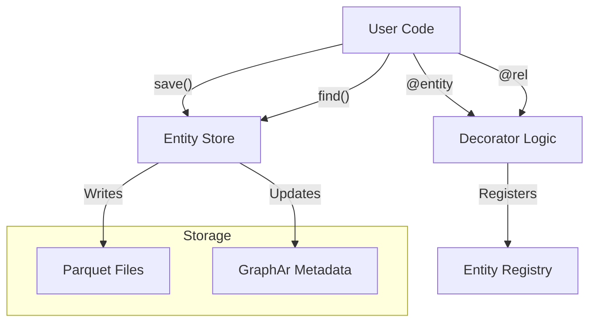

# Entity Framework

ParquetFrame's Entity Framework provides a powerful, decorator-based system for defining entities with relationships, automatic storage management, and GraphAr-compliant persistence.

## Overview

- **🎯 Declarative Models** - Define entities with `@entity` and relationships with `@rel`
- **🔗 Automatic Relationships** - Bidirectional relationship traversal
- **💾 Smart Storage** - Parquet-based persistence with automatic schema management
- **📊 GraphAr Integration** - Store entities as GraphAr-compliant graphs

## Architecture



## Quick Start

> [!TIP]
> See **[Advanced Examples](advanced-examples.md)** for many-to-many relationships and inheritance.

```python
from parquetframe.entity import entity, rel
from dataclasses import dataclass

@entity(storage_path="./data/users", primary_key="user_id")
@dataclass
class User:
    user_id: str
    username: str
    email: str

@entity(storage_path="./data/posts", primary_key="post_id")
@dataclass
class Post:
    post_id: str
    title: str
    author_id: str = rel("User", "user_id")

# Usage
user = User(user_id="u1", username="alice", email="alice@example.com")
user.save()

post = Post(post_id="p1", title="Hello", author_id="u1")
post.save()

# Automatic relationship traversal
author = post.author  # Loads User("u1")
user_posts = user.posts  # All posts by user
```

## Key Features

### `@entity` Decorator
Converts dataclasses into persistent entities with automatic Parquet storage.

### `@rel` Decorator
Defines relationships between entities with automatic traversal.

### Storage Management
- Schema evolution support
- Snappy compression
- GraphAr compliance option

### Querying
```python
user = User.find("u1")  # By primary key
all_users = User.find_all()  # All entities
active = User.find_all(filter=lambda u: u.active)  # Filtered
```

## Real-World Example

See [Todo/Kanban Example](../documentation-examples/todo-kanban.md) for a complete multi-entity application.

## Related Categories

- **[Permissions System](../permissions-system/index.md)** - Access control for entities
- **[Graph Processing](../graph-processing/index.md)** - GraphAr entity storage
- **[Core Features](../core-features/index.md)** - DataFrame operations

## API Reference

- `@entity` - Entity decorator
- `@rel` - Relationship decorator
- `Entity.save()` - Persist entity
- `Entity.find()` - Load by key
- `Entity.find_all()` - Load all
