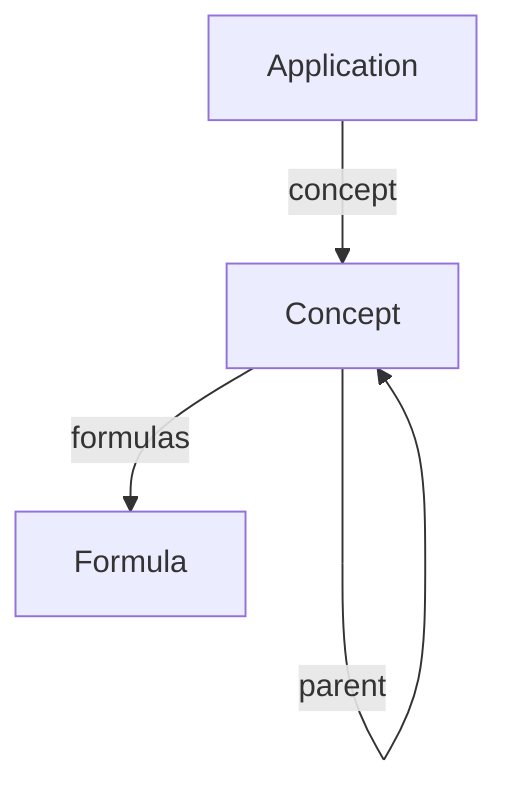

# Knowlogy: Computable Knowledge Graph

Knowlogy is a local-first, computable knowledge graph that grounds ParquetFrame in formal, symbolic truth.

## Overview

It connects **Formulas** ($E=mc^2$) to **Concepts** ("Special Relativity") and **Applications** ("Nuclear Power"), enabling semantic search and verifiable RAG responses.

## Usage

```python
from parquetframe import knowlogy

# 1. Search for a concept
concepts = knowlogy.search("mean")
for c in concepts:
    print(f"{c.name}: {c.description}")

# 2. Get a formula
formula = knowlogy.get_formula("Arithmetic Mean")
if formula:
    print(f"LaTeX: {formula.latex}")
    # Output: \overline{x} = \frac{\Sigma x_i}{n}

# 3. RAG Grounding
context = knowlogy.get_context("How do I calculate standard deviation?")
# Returns structured context to inject into LLM prompt
```

## Architecture

The graph is stored as Parquet files using the **Entity Framework**.



## Entities

- **Concept**: Abstract idea (e.g., "Variance").
- **Formula**: Mathematical definition (e.g., $\sigma^2 = ...$).
- **Application**: Real-world use case.
