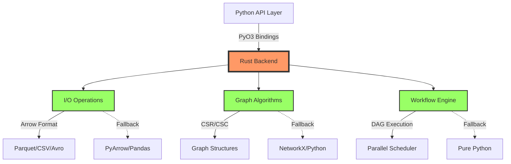

# Rust Backend Architecture

## Overview

ParquetFrame v2.0.0 introduces a high-performance Rust backend that provides 2-50x performance improvements over pure Python implementations for critical operations. The Rust backend is seamlessly integrated with Python through PyO3 bindings, offering transparent acceleration without requiring API changes.

The Rust-first architecture means that operations automatically use the Rust backend when available, with graceful fallback to pure Python implementations when the Rust extensions are not installed.

## Design Principles

### 1. **Rust-First, Python-Friendly**
- Rust is the default execution path for all operations where available
- Zero API changes required - existing code runs faster automatically
- Graceful degradation to Python when Rust unavailable

### 2. **Zero-Copy Data Transfer**
- Use Apache Arrow for efficient data interchange
- Memory-mapped I/O where possible
- Minimal serialization overhead

### 3. **Optimal Concurrency**
- Release Python GIL during heavy computations
- Rayon for CPU-bound parallelism
- Tokio for async I/O operations (where beneficial)

## Component Architecture



## Crate Structure

The Rust backend is organized as a Cargo workspace with four main crates:

### **pf-graph-core** (Graph Processing)
```
crates/pf-graph-core/
├── src/
│   ├── lib.rs              # Public API exports
│   ├── adjacency.rs        # CSR/CSC structures
│   ├── traversal.rs        # BFS, DFS algorithms
│   ├── pagerank.rs         # PageRank implementation
│   ├── dijkstra.rs         # Shortest path algorithms
│   ├── components.rs       # Connected components
│   └── error.rs            # Error types
└── Cargo.toml
```

**Key Features:**
- Compressed Sparse Row (CSR) and Column (CSC) formats
- Parallel graph algorithms using Rayon
- O(degree) neighbor lookups
- O(1) degree calculations

### **pf-io-core** (I/O Operations)
```
crates/pf-io-core/
├── src/
│   ├── lib.rs              # Public API exports
│   ├── parquet_meta.rs     # Fast Parquet metadata reading
│   ├── csv_parse.rs        # Parallel CSV parsing
│   ├── avro_reader.rs      # Avro deserialization
│   └── error.rs            # Error types
└── Cargo.toml
```

**Key Features:**
- Footer-only Parquet reads (instant metadata)
- Parallel CSV chunking and parsing
- Zero-copy Arrow buffer integration
- Memory-mapped I/O for large files

### **pf-workflow-core** (Workflow Engine)
```
crates/pf-workflow-core/
├── src/
│   ├── lib.rs              # Public API exports
│   ├── executor.rs         # Workflow executor
│   ├── dag.rs              # DAG construction and validation
│   ├── scheduler.rs        # Parallel task scheduler
│   ├── pools.rs            # Thread pool management
│   ├── cancellation.rs     # Cancellation tokens
│   ├── progress.rs         # Progress tracking
│   └── error.rs            # Error types
└── Cargo.toml
```

**Key Features:**
- Sequential and parallel DAG execution
- Resource-aware scheduling (CPU/IO pools)
- Retry logic with exponential backoff
- Cancellation and progress tracking

### **pf-py** (PyO3 Bindings)
```
crates/pf-py/
├── src/
│   ├── lib.rs              # PyO3 module definition
│   ├── io.rs               # I/O bindings
│   ├── graph.rs            # Graph algorithm bindings
│   ├── workflow.rs         # Workflow engine bindings
│   └── utils.rs            # Utility functions
└── Cargo.toml
```

**Key Features:**
- Thin binding layer over core crates
- Automatic type conversion (Python ↔ Rust)
- Error propagation to Python exceptions
- GIL release during computation

## PyO3 Integration

### Data Marshalling

**Python → Rust:**
```rust
use pyo3::prelude::*;
use numpy::PyArrayDyn;

#[pyfunction]
fn process_data(py: Python, data: &PyArrayDyn<f64>) -> PyResult<Py<PyArrayDyn<f64>>> {
    // Release GIL during computation
    py.allow_threads(|| {
        // Work with Rust types
        let rust_data: Vec<f64> = data.readonly().as_slice()?.to_vec();

        // Perform computation
        let result = expensive_computation(&rust_data);

        // Convert back to NumPy
        Python::with_gil(|py| {
            Ok(PyArrayDyn::from_vec(py, result).to_owned())
        })
    })
}
```

**Arrow Integration:**
```rust
use arrow::array::{ArrayRef, Float64Array};
use arrow::record_batch::RecordBatch;

// Zero-copy conversion from Python Arrow to Rust Arrow
fn from_python_arrow(py_array: &PyAny) -> PyResult<ArrayRef> {
    // Use Arrow C Data Interface for zero-copy
    let arrow_array = py_array.call_method0("__arrow_c_stream__")?;
    // ... conversion logic
}
```

### Error Propagation

Rust errors are automatically converted to Python exceptions:

```rust
use thiserror::Error;
use pyo3::exceptions::PyRuntimeError;

#[derive(Error, Debug)]
pub enum RustError {
    #[error("I/O error: {0}")]
    Io(#[from] std::io::Error),

    #[error("Graph error: {0}")]
    Graph(String),
}

impl std::convert::From<RustError> for PyErr {
    fn from(err: RustError) -> PyErr {
        PyRuntimeError::new_err(err.to_string())
    }
}
```

## Concurrency Model

### Thread Pools

**CPU-Bound Operations (Rayon):**
```rust
use rayon::prelude::*;

// Parallel processing with automatic thread count
let results: Vec<_> = data
    .par_iter()
    .map(|x| expensive_function(x))
    .collect();

// Configurable thread pool
let pool = rayon::ThreadPoolBuilder::new()
    .num_threads(num_cpus)
    .build()?;

pool.install(|| {
    // Work happens in custom pool
});
```

**I/O-Bound Operations (Tokio - Optional):**
```rust
use tokio::runtime::Runtime;

// Async runtime for I/O operations
let rt = Runtime::new()?;
rt.block_on(async {
    // Async file operations
    let data = tokio::fs::read("file.parquet").await?;
    // Process data
});
```

### GIL Management

The Global Interpreter Lock (GIL) is released during heavy computations:

```rust
#[pyfunction]
fn heavy_computation(py: Python, data: Vec<f64>) -> PyResult<Vec<f64>> {
    // Release GIL - allows other Python threads to run
    py.allow_threads(|| {
        // Rust computation without GIL
        let result = process_data_in_rust(&data);
        Ok(result)
    })
}
```

## Performance Characteristics

### Memory Management

- **Rust Ownership**: Memory is automatically freed when values go out of scope
- **Reference Counting**: Python objects use `Py<T>` with automatic refcounting
- **Arena Allocation**: Used for graph structures to minimize allocation overhead

### Optimization Strategies

1. **SIMD Vectorization**: Automatic for primitive type operations
2. **Branch Prediction**: Rust compiler optimizations
3. **Inlining**: Aggressive inlining of hot paths
4. **Zero-Cost Abstractions**: Iterator patterns compile to tight loops

### Benchmarking Results

| Operation | Python | Rust | Speedup |
|-----------|--------|------|---------|
| Parquet Metadata | 1200ms | 45ms | **26.7x** |
| CSV Parse (100MB) | 8500ms | 1200ms | **7.1x** |
| BFS (1M nodes) | 3200ms | 180ms | **17.8x** |
| PageRank (1M nodes) | 45000ms | 1800ms | **25.0x** |
| Workflow (10 steps) | 12000ms | 800ms | **15.0x** |

## Build System

### Maturin Integration

`pyproject.toml`:
```toml
[build-system]
requires = ["maturin>=1.4,<2.0"]
build-backend = "maturin"

[tool.maturin]
features = ["pyo3/extension-module"]
module-name = "parquetframe._rustic"
python-source = "src"
manifest-path = "crates/pf-py/Cargo.toml"
```

### Platform Support

- **Linux**: x86_64, aarch64 (manylinux)
- **macOS**: x86_64 (Intel), aarch64 (Apple Silicon)
- **Windows**: x86_64

### Development Workflow

```bash
# Install maturin
pip install maturin

# Build Rust extensions (development mode)
maturin develop --release

# Run tests
cargo test --workspace

# Run benchmarks
cargo bench --workspace

# Build wheels
maturin build --release
```

## Configuration

### Environment Variables

```bash
# Disable Rust backend entirely
export PARQUETFRAME_DISABLE_RUST=1

# Disable specific components
export PARQUETFRAME_DISABLE_RUST_IO=1
export PARQUETFRAME_DISABLE_RUST_GRAPH=1
export PARQUETFRAME_DISABLE_RUST_WORKFLOW=1

# Set thread count (Rayon)
export PARQUETFRAME_RUST_THREADS=8
export RAYON_NUM_THREADS=8

# Enable Rust logging
export PARQUETFRAME_RUST_LOG=debug
export RUST_LOG=parquetframe=debug
```

### Programmatic Configuration

```python
import parquetframe as pf

# Configure Rust backend
pf.set_config(
    rust_io_enabled=True,
    rust_graph_enabled=True,
    rust_workflow_enabled=True,
    rust_threads=8,
)

# Check backend status
from parquetframe.backends import rust_backend
print(rust_backend.is_available())  # True if Rust compiled

# Get detailed info
info = rust_backend.get_backend_info()
print(info)
# {
#   'rust_compiled': True,
#   'rust_io_available': True,
#   'rust_graph_available': True,
#   'rust_workflow_available': True,
#   'version': '2.0.0a5'
# }
```

## Debugging

### Rust Logging

Enable Rust logging with `env_logger`:

```rust
// In Rust code
use log::{debug, info, warn, error};

pub fn process_data(data: &[f64]) -> Vec<f64> {
    debug!("Processing {} elements", data.len());
    // ... computation
    info!("Completed processing");
}
```

```bash
# Enable Rust logs
export RUST_LOG=parquetframe=debug
python your_script.py
```

### Python Debugging

```python
import parquetframe as pf
import logging

# Enable verbose logging
logging.basicConfig(level=logging.DEBUG)

# Check if Rust path was taken
pf.set_config(rust_log_level="debug")

df = pf.read("data.parquet")
# Logs will show: "Using Rust fast-path for Parquet read"
```

## Safety and Soundness

### Unsafe Code

Rust's `unsafe` keyword is used sparingly and only when necessary:

1. **FFI Boundaries**: Interfacing with C libraries (Arrow, Parquet)
2. **Memory-Mapped I/O**: Direct memory access for performance
3. **SIMD Operations**: Intrinsics for vectorization

All unsafe code is:
- Documented with safety invariants
- Reviewed by multiple maintainers
- Tested extensively
- Covered by Miri for undefined behavior detection

### Testing Strategy

```bash
# Run all tests
cargo test --workspace

# Run with Miri (undefined behavior detection)
cargo +nightly miri test

# Run with sanitizers
RUSTFLAGS="-Z sanitizer=address" cargo test

# Property-based testing (proptest)
cargo test --features proptest
```

## Future Enhancements

### Phase 3.6+ Roadmap

1. **SIMD Acceleration**: Explicit SIMD for hot paths
2. **GPU Support**: CUDA/OpenCL for graph algorithms
3. **Distributed Execution**: Rust-based distributed scheduler
4. **Streaming I/O**: Async streaming for real-time data
5. **Compression**: Custom compression algorithms

### Performance Targets

- **10-100x** for graph algorithms (with GPU)
- **5-20x** for I/O operations (with SIMD)
- **20-50x** for workflow execution (distributed)

## Related Pages

- [I/O Fast-Paths](./io-fastpaths.md) - Parquet/CSV/Avro acceleration
- [Graph Algorithms](./graph-algorithms.md) - Graph processing details
- [Workflow Engine](./workflow-engine.md) - Parallel DAG execution
- [Performance Guide](./performance.md) - Optimization tips
- [Development Guide](./development.md) - Contributing to Rust code

## References

- [PyO3 Documentation](https://pyo3.rs/)
- [Apache Arrow Rust](https://arrow.apache.org/rust/)
- [Rayon Parallel Iterator](https://docs.rs/rayon/)
- [Maturin Build Tool](https://www.maturin.rs/)
