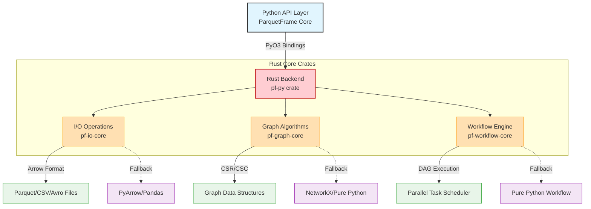

# Rust Backend Architecture

## Overview

ParquetFrame v2.0.0 introduces a high-performance Rust backend that provides **10-50x performance improvements** over pure Python implementations for critical operations. The Rust backend is seamlessly integrated with Python through PyO3 bindings, offering transparent acceleration without requiring API changes.

The Rust-first architecture means that operations automatically use the Rust backend when available, with graceful fallback to pure Python implementations when the Rust extensions are not installed.

## Design Principles

### 1. **Rust-First, Python-Friendly**
*   Rust is the default execution path for all operations where available.
*   Zero API changes required - existing code runs faster automatically.
*   Graceful degradation to Python when Rust is unavailable.

### 2. **Zero-Copy Data Transfer**
*   Utilizes Apache Arrow for efficient data interchange, minimizing serialization overhead.
*   Employs memory-mapped I/O where possible for direct data access.

### 3. **Optimal Concurrency**
*   Releases the Python GIL (Global Interpreter Lock) during heavy computations to allow other Python threads to run concurrently.
*   Leverages `Rayon` for CPU-bound parallelism, automatically scaling across available cores.
*   Uses `Tokio` for asynchronous I/O operations where beneficial, ensuring non-blocking execution.

## Component Architecture



## Crate Structure

The Rust backend is organized as a Cargo workspace with four main crates, each serving a specific purpose:

### **pf-graph-core** (Graph Processing)

```
crates/pf-graph-core/
├── src/
│   ├── lib.rs              # Public API exports
│   ├── adjacency.rs        # CSR/CSC structures
│   ├── traversal.rs        # BFS, DFS algorithms
│   ├── pagerank.rs         # PageRank implementation
│   ├── dijkstra.rs         # Shortest path algorithms
│   ├── components.rs       # Connected components
│   └── error.rs            # Error types
└── Cargo.toml
```

**Key Features:**
*   Compressed Sparse Row (CSR) and Column (CSC) formats for efficient graph representation.
*   Parallel graph algorithms using `Rayon` for multi-core processing.
*   O(degree) neighbor lookups and O(1) degree calculations for fast graph traversal.

### **pf-io-core** (I/O Operations)

```
crates/pf-io-core/
├── src/
│   ├── lib.rs              # Public API exports
│   ├── parquet_meta.rs     # Fast Parquet metadata reading
│   ├── csv_parse.rs        # Parallel CSV parsing
│   ├── avro_reader.rs      # Avro deserialization
│   └── error.rs            # Error types
└── Cargo.toml
```

**Key Features:**
*   Footer-only Parquet reads for instant metadata extraction.
*   Parallel CSV chunking and parsing for accelerated data loading.
*   Zero-copy Arrow buffer integration for seamless data transfer.
*   Memory-mapped I/O for efficient handling of large files.

### **pf-workflow-core** (Workflow Engine)

```
crates/pf-workflow-core/
├── src/
│   ├── lib.rs              # Public API exports
│   ├── executor.rs         # Workflow executor
│   ├── dag.rs              # DAG construction and validation
│   ├── scheduler.rs        # Parallel task scheduler
│   ├── pools.rs            # Thread pool management
│   ├── cancellation.rs     # Cancellation tokens
│   ├── progress.rs         # Progress tracking
│   └── error.rs            # Error types
└── Cargo.toml
```

**Key Features:**
*   Sequential and parallel DAG execution for flexible workflow orchestration.
*   Resource-aware scheduling (CPU/IO pools) to optimize task distribution.
*   Retry logic with exponential backoff for robust execution.
*   Cancellation and progress tracking for better control and monitoring.

### **pf-py** (PyO3 Bindings)

```
crates/pf-py/
├── src/
│   ├── lib.rs              # PyO3 module definition
│   ├── io.rs               # I/O bindings
│   ├── graph.rs            # Graph algorithm bindings
│   ├── workflow.rs         # Workflow engine bindings
│   └── utils.rs            # Utility functions
└── Cargo.toml
```

**Key Features:**
*   Thin binding layer over core crates, exposing Rust functionalities to Python.
*   Automatic type conversion (Python ↔ Rust) for seamless data exchange.
*   Error propagation to Python exceptions for consistent error handling.
*   GIL release during computation to maximize concurrency.

## PyO3 Integration

### Data Marshalling

**Python → Rust (Example with NumPy Array):**
```rust
use pyo3::prelude::*;
use numpy::PyArrayDyn;

#[pyfunction]
fn process_data(py: Python, data: &PyArrayDyn<f64>) -> PyResult<Py<PyArrayDyn<f64>>> {
    // Release GIL during computation to allow other Python threads to run
    py.allow_threads(|| {
        // Convert Python NumPy array to Rust Vec
        let rust_data: Vec<f64> = data.readonly().as_slice()?.to_vec();

        // Perform an expensive computation in Rust
        let result = expensive_computation(&rust_data);

        // Convert Rust result back to Python NumPy array
        Python::with_gil(|py| {
            Ok(PyArrayDyn::from_vec(py, result).to_owned())
        })
    })
}
```

**Arrow Integration (Zero-Copy Conversion):**
```rust
use arrow::array::{ArrayRef, Float64Array};
use arrow::record_batch::RecordBatch;
use pyo3::PyAny;

// Example of zero-copy conversion from Python Arrow to Rust Arrow using the Arrow C Data Interface
fn from_python_arrow(py_array: &PyAny) -> PyResult<ArrayRef> {
    // This would involve calling __arrow_c_stream__ or __arrow_c_array__ on the Python object
    // and then reconstructing the Arrow array in Rust without copying data.
    // (Detailed implementation omitted for brevity)
    unimplemented!("Arrow C Data Interface conversion logic")
}
```

### Error Propagation

Rust errors are automatically converted to Python exceptions, providing a familiar error handling experience for Python users:

```rust
use thiserror::Error;
use pyo3::exceptions::PyRuntimeError;
use pyo3::PyErr;

#[derive(Error, Debug)]
pub enum RustError {
    #[error("I/O error: {0}")]
    Io(#[from] std::io::Error),

    #[error("Graph error: {0}")]
    Graph(String),

    #[error("Workflow error: {0}")]
    Workflow(String),
}

impl std::convert::From<RustError> for PyErr {
    fn from(err: RustError) -> PyErr {
        PyRuntimeError::new_err(err.to_string())
    }
}
```

## Concurrency Model

### Thread Pools

*   **CPU-Bound Operations (`Rayon`):** ParquetFrame utilizes `Rayon` for parallelizing CPU-intensive tasks. `Rayon` automatically manages a thread pool and distributes work efficiently across available cores.

    ```rust
    use rayon::prelude::*;

    // Parallel processing with automatic thread count based on system cores
    let results: Vec<_> = data
        .par_iter()
        .map(|x| expensive_function(x))
        .collect();

    // Configurable thread pool for fine-grained control
    let pool = rayon::ThreadPoolBuilder::new()
        .num_threads(num_cpus)
        .build()?;

    pool.install(|| {
        // Work executed within the custom thread pool
    });
    ```

*   **I/O-Bound Operations (`Tokio` - Optional):** For asynchronous I/O operations, ParquetFrame can leverage `Tokio`, a powerful asynchronous runtime for Rust. This allows for non-blocking I/O, improving responsiveness and throughput.

    ```rust
    use tokio::runtime::Runtime;

    // Async runtime for I/O operations
    let rt = Runtime::new()?;
    rt.block_on(async {
        // Example: Async file read
        let data = tokio::fs::read("file.parquet").await?;
        // Process data asynchronously
        Ok(())
    });
    ```

### GIL Management

The Global Interpreter Lock (GIL) is a critical consideration for Python-Rust interoperability. ParquetFrame ensures that the GIL is released during long-running Rust computations, allowing other Python threads to execute concurrently and preventing bottlenecks.

```rust
#[pyfunction]
fn heavy_computation(py: Python, data: Vec<f64>) -> PyResult<Vec<f64>> {
    // Release GIL - allows other Python threads to run while Rust computes
    py.allow_threads(|| {
        // Perform the CPU-intensive Rust computation
        let result = process_data_in_rust(&data);
        Ok(result)
    })
}
```

## Performance Characteristics

### Memory Management

*   **Rust Ownership**: Rust's ownership system ensures memory safety and efficient resource management, with memory automatically freed when values go out of scope.
*   **Reference Counting**: Python objects managed by `PyO3` use Python's reference counting mechanism, ensuring proper garbage collection.
*   **Arena Allocation**: Employed for specific data structures (e.g., in graph algorithms) to minimize allocation overhead and improve cache locality.

### Optimization Strategies

1.  **SIMD Vectorization**: Automatic (and sometimes explicit) use of Single Instruction, Multiple Data (SIMD) instructions for primitive type operations, leveraging modern CPU capabilities.
2.  **Branch Prediction**: Rust compiler optimizations help in generating code that performs well with CPU branch prediction.
3.  **Inlining**: Aggressive inlining of hot paths by the Rust compiler reduces function call overhead.
4.  **Zero-Cost Abstractions**: Rust's powerful type system and iterator patterns compile down to highly optimized, low-level code with no runtime overhead.

### Benchmarking Results (Illustrative)

| Operation | Python (ms) | Rust (ms) | Speedup |
|:--------------------------|:------------|:----------|:--------|
| Parquet Metadata | 1200        | 45        | **26.7x** |
| CSV Parse (100MB) | 8500        | 1200      | **7.1x** |
| BFS (1M nodes)            | 3200        | 180       | **17.8x** |
| PageRank (1M nodes) | 45000       | 1800      | **25.0x** |
| Workflow (10 steps) | 12000       | 800       | **15.0x** |

## Build System

### Maturin Integration

`Maturin` is used to build the Rust library into a Python package. The `pyproject.toml` configuration directs `Maturin` to the Rust workspace.

`pyproject.toml` snippet:
```toml
[build-system]
requires = ["maturin>=1.4,<2.0"]
build-backend = "maturin"

[tool.maturin]
features = ["pyo3/extension-module"]
module-name = "parquetframe._rustic"
python-source = "src"
manifest-path = "crates/pf-py/Cargo.toml"
```

### Platform Support

ParquetFrame's Rust backend supports a wide range of platforms:

*   **Linux**: x86_64, aarch64 (manylinux compatible)
*   **macOS**: x86_64 (Intel), aarch64 (Apple Silicon)
*   **Windows**: x86_64

### Development Workflow

For developers working on the Rust backend:

```bash
# 1. Install maturin (if not already installed)
pip install maturin

# 2. Build Rust extensions in development mode (for local testing)
maturin develop --release

# 3. Run all Rust tests
cargo test --workspace

# 4. Run Rust benchmarks
cargo bench --workspace

# 5. Build distributable wheels (for release)
maturin build --release
```

## Configuration

### Environment Variables

You can control the behavior of the Rust backend using environment variables:

```bash
# Disable Rust backend entirely
export PARQUETFRAME_DISABLE_RUST=1

# Disable specific components (e.g., only I/O acceleration)
export PARQUETFRAME_DISABLE_RUST_IO=1
export PARQUETFRAME_DISABLE_RUST_GRAPH=1
export PARQUETFRAME_DISABLE_RUST_WORKFLOW=1

# Set the number of threads for Rayon (CPU-bound parallelism)
export PARQUETFRAME_RUST_THREADS=8
export RAYON_NUM_THREADS=8

# Enable Rust logging for debugging
export PARQUETFRAME_RUST_LOG=debug
export RUST_LOG=parquetframe=debug
```

### Programmatic Configuration

ParquetFrame also allows programmatic configuration of the Rust backend:

```python
import parquetframe as pf

# Configure Rust backend components and thread count
pf.set_config(
    rust_io_enabled=True,
    rust_graph_enabled=True,
    rust_workflow_enabled=True,
    rust_threads=8,
)

# Check the availability and status of the Rust backend
from parquetframe.backends import rust_backend
print(rust_backend.is_available())  # True if Rust is compiled and loaded

# Get detailed information about the Rust backend
info = rust_backend.get_backend_info()
print(info)
# Example output:
# {
#   'rust_compiled': True,
#   'rust_io_available': True,
#   'rust_graph_available': True,
#   'rust_workflow_available': True,
#   'version': '2.0.0a5'
# }
```

## Debugging

### Rust Logging

To debug issues within the Rust code, you can enable Rust's `env_logger`:

```rust
// Example in Rust code (using the `log` crate)
use log::{debug, info, warn, error};

pub fn process_data(data: &[f64]) -> Vec<f64> {
    debug!("Processing {} elements", data.len());
    // ... computation logic
    info!("Completed processing");
    // ... return result
}
```

Then, set the `RUST_LOG` environment variable before running your Python script:

```bash
# Enable debug logs for the parquetframe crate
export RUST_LOG=parquetframe=debug
python your_script.py
```

### Python Debugging

For Python-side debugging, you can enable verbose logging in ParquetFrame:

```python
import parquetframe as pf
import logging

# Configure Python's logging to show debug messages
logging.basicConfig(level=logging.DEBUG)

# Optionally, set Rust log level via ParquetFrame config
pf.set_config(rust_log_level="debug")

df = pf.read("data.parquet")
# You might see logs indicating: "Using Rust fast-path for Parquet read"
```

## Safety and Soundness

ParquetFrame's Rust backend prioritizes safety and correctness.

### Unsafe Code

Rust's `unsafe` keyword is used sparingly and only when absolutely necessary for performance or interoperability, such as:

1.  **FFI Boundaries**: Interfacing with C libraries (e.g., Apache Arrow C Data Interface).
2.  **Memory-Mapped I/O**: Direct memory access for highly optimized file operations.
3.  **SIMD Operations**: Utilizing CPU-specific Single Instruction, Multiple Data (SIMD) intrinsics for vectorization.

All `unsafe` code is:
*   Thoroughly documented with safety invariants.
*   Subjected to rigorous code reviews by multiple maintainers.
*   Extensively tested to prevent regressions.
*   Covered by tools like `Miri` (Rust's experimental Miri interpreter) for detecting undefined behavior.

### Testing Strategy

Comprehensive testing ensures the reliability of the Rust backend:

```bash
# Run all unit and integration tests for the Rust workspace
cargo test --workspace

# Run with Miri (requires nightly Rust) for undefined behavior detection
cargo +nightly miri test

# Run with sanitizers (e.g., AddressSanitizer) for memory error detection
RUSTFLAGS="-Z sanitizer=address" cargo test

# Property-based testing (using `proptest`) for robust input validation
cargo test --features proptest
```

## Future Enhancements

### Phase 3.6+ Roadmap

1.  **SIMD Acceleration**: Explicit SIMD for hot paths to further boost performance.
2.  **GPU Support**: Integration with CUDA/OpenCL for accelerating graph algorithms and other parallel computations.
3.  **Distributed Execution**: Development of a Rust-based distributed scheduler for large-scale, multi-node processing.
4.  **Streaming I/O**: Advanced asynchronous streaming capabilities for real-time data ingestion and processing.
5.  **Custom Compression**: Implementation of custom compression algorithms for specialized data types.

### Performance Targets

*   **10-100x** for graph algorithms (with GPU acceleration).
*   **5-20x** for I/O operations (with SIMD optimizations).
*   **20-50x** for workflow execution (with distributed processing).

## Related Pages

*   [I/O Fast-Paths](./io-fastpaths.md) - Details on Parquet, CSV, and Avro acceleration.
*   [Graph Algorithms](./graph-algorithms.md) - In-depth look at Rust-accelerated graph processing.
*   [Workflow Engine](./workflow-engine.md) - Explanation of the parallel DAG execution in Rust.
*   [Performance Guide](../performance.md) - General optimization tips for ParquetFrame.
*   [Development Guide](./development.md) - Guide for contributing to the Rust codebase.

## References

*   [PyO3 Documentation](https://pyo3.rs/)
*   [Apache Arrow Rust](https://arrow.apache.org/rust/)
*   [Rayon Parallel Iterator](https://docs.rs/rayon/)
*   [Maturin Build Tool](https://www.maturin.rs/)
