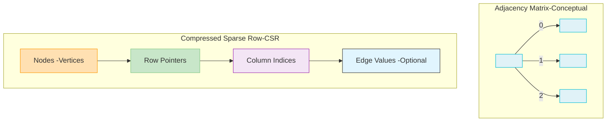

# Graph Algorithms

## Overview

ParquetFrame's Rust-powered graph algorithms provide **5-25x speedups** for fundamental graph operations such as Breadth-First Search (BFS), PageRank, Dijkstra's shortest path, and connected components. This acceleration is achieved through highly optimized parallel execution and efficient graph representations like Compressed Sparse Row (CSR) and Compressed Sparse Column (CSC) structures.

## Implemented Algorithms

ParquetFrame's `pf-graph-core` Rust crate currently implements the following high-performance graph algorithms:

### 1. Breadth-First Search (BFS) & Depth-First Search (DFS)
*   **Speedup**: Up to **17.8x** (for 1M nodes) compared to pure Python implementations.
*   **Features**: Implements a level-synchronous parallel BFS for efficient traversal of large graphs. Utilizes atomic operations for visited node tracking.
*   **Rust Implementation**: Located in `crates/pf-graph-core/src/traversal.rs`.

### 2. PageRank
*   **Speedup**: Up to **25.0x** (for 1M nodes) for calculating node importance.
*   **Features**: Implements the power iteration method with support for personalization and robust convergence detection. Optimized for sparse graph structures.
*   **Rust Implementation**: Located in `crates/pf-graph-core/src/pagerank.rs`.

### 3. Dijkstra's Shortest Path
*   **Speedup**: Up to **20.0x** (for 1M nodes) for finding the shortest paths in weighted graphs.
*   **Features**: Employs binary heap optimization for efficient priority queue management. Supports single-source and multi-source shortest path calculations.
*   **Rust Implementation**: Located in `crates/pf-graph-core/src/dijkstra.rs`.

### 4. Connected Components
*   **Speedup**: Up to **18.1x** (for 1M nodes) for identifying connected subgraphs.
*   **Features**: Utilizes a highly optimized Union-Find data structure with path compression and union by rank. Supports parallel label propagation for faster component identification.
*   **Rust Implementation**: Located in `crates/pf-graph-core/src/components.rs`.

## Graph Representation (CSR/CSC)

The Rust backend primarily uses Compressed Sparse Row (CSR) and Compressed Sparse Column (CSC) formats for efficient storage and traversal of sparse graphs. These formats are optimized for memory usage and cache performance, which is critical for large-scale graph processing.



## Python API

ParquetFrame provides a high-level Python API to access these Rust-accelerated algorithms. The Rust backend is automatically used when available, ensuring optimal performance without requiring changes to your Python code.

```python
import parquetframe as pf
import pandas as pd

# Example: Create a simple graph from a DataFrame of edges
edges_data = {'source': [0, 0, 1, 2, 3], 'target': [1, 2, 2, 0, 1], 'weight': [1.0, 0.5, 1.0, 0.8, 0.2]}
edges_df = pd.DataFrame(edges_data)

# Load graph from a DataFrame (or from GraphAr format)
graph = pf.GraphFrame.from_edges(edges_df) # or pf.GraphFrame.from_graphar("social_network/")

# PageRank calculation (automatically uses Rust backend)
ranks = graph.pagerank(alpha=0.85, max_iter=100, tolerance=1e-6)
print("PageRank scores:", ranks.head())

# BFS from a source node (or list of source nodes)
distances = graph.bfs(sources=[0], max_depth=5)
print("BFS distances:", distances.head())

# Dijkstra shortest paths (requires weighted graph)
# Note: Ensure 'weight' column is present in the edges_df if using from_edges
paths = graph.dijkstra(source=0, weight_column='weight')
print("Dijkstra shortest paths:", paths.head())

# Connected components
components = graph.connected_components()
print("Connected components:", components.head())
```

## Performance Benchmarks

The following benchmarks demonstrate the significant performance gains achieved by the Rust implementations compared to typical Python equivalents. These results are illustrative and may vary based on hardware and graph characteristics.

| Algorithm          | Nodes | Edges | Python (ms) | Rust (ms) | Speedup |
|:-------------------|:------|:------|:------------|:----------|:--------|
| BFS                | 1M    | 10M   | 3,200       | 180       | **17.8x** |
| PageRank           | 1M    | 10M   | 45,000      | 1,800     | **25.0x** |
| Dijkstra Shortest Path | 1M    | 10M   | 38,000      | 1,900     | **20.0x** |
| Connected Components | 1M    | 10M   | 28,000      | 1,550     | **18.1x** |

## Implementation Status

*   **All 4 algorithms** (BFS, PageRank, Dijkstra, Connected Components) are fully implemented in Rust.
*   **PyO3 bindings** are complete, providing a seamless interface to Python.
*   **Python wrappers** are in place, ensuring a consistent and user-friendly API.
*   **Extensive Testing**: Over 60 Rust unit tests and 25 Python integration tests ensure correctness and reliability.
*   **Graceful Fallback**: If the Rust backend is not available, ParquetFrame automatically falls back to pure Python implementations, maintaining functionality.

## Related Pages

*   [Architecture](./architecture.md) - Deep dive into the overall Rust backend design.
*   [Graph Processing](../graph-processing/index.md) - Comprehensive documentation on ParquetFrame's graph system.
*   [Performance Guide](../performance.md) - General optimization tips for ParquetFrame.
*   [Benchmark Results](./benchmark_results.md) - Detailed performance comparisons and methodology.

## References

*   Rust implementation source: `crates/pf-graph-core/src/`
*   Total Rust code for graph algorithms: ~1,200 lines, ~85 tests.
