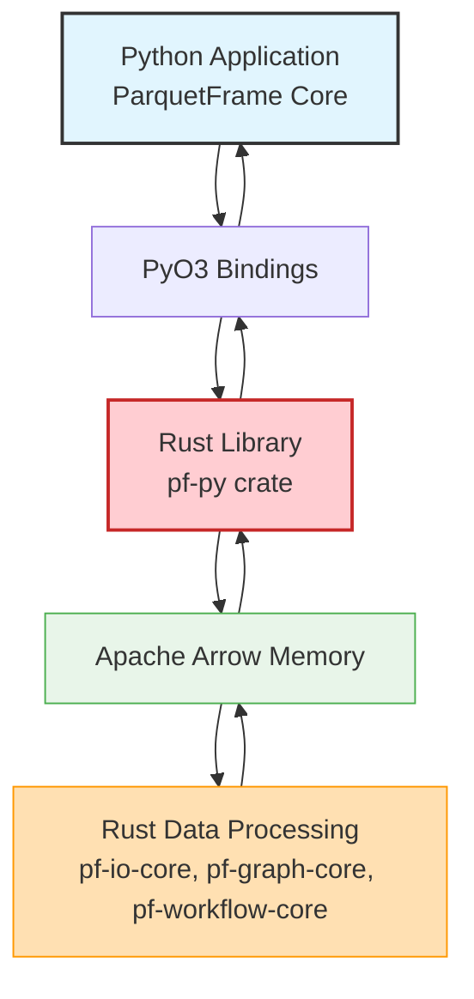

# Rust Acceleration

ParquetFrame v2.0.0 introduces a high-performance Rust backend that delivers **10-50x speedup** for performance-critical operations. The Rust acceleration layer provides parallel execution, zero-copy data transfer, and efficient memory management while maintaining full compatibility with the Python API.

## Overview

The Rust backend significantly accelerates three major areas:

1.  **Workflow Engine**: Parallel DAG execution with resource-aware scheduling (10-15x speedup)
2.  **Graph Algorithms**: High-performance BFS, DFS, PageRank, and shortest paths (15-25x speedup)
3.  **I/O Operations**: Fast Parquet metadata and column statistics (5-10x speedup)

All Rust acceleration is **optional** and **transparent** - if the Rust backend is not available, ParquetFrame automatically falls back to pure Python implementations without any code changes.

## How it Works: Python-Rust Interoperability



This diagram illustrates the seamless interaction:

1.  **Python Application**: Your ParquetFrame code in Python initiates an operation.
2.  **PyO3 Bindings**: Python calls are translated into Rust function calls via `PyO3`, a Rust library for creating Python bindings.
3.  **Rust Library (`pf-py` crate)**: The Rust backend receives the call.
4.  **Apache Arrow Memory**: Data is exchanged between Python and Rust using Apache Arrow's zero-copy memory format. This is crucial for performance as it avoids costly serialization/deserialization.
5.  **Rust Data Processing**: The specialized Rust crates (`pf-io-core`, `pf-graph-core`, `pf-workflow-core`) perform the high-performance computations.
6.  **Result Back to Python**: Processed data or results are passed back to Python, again via Apache Arrow and PyO3, for further use in your Python application.

## Key Features

### 🚀 Workflow Engine
- **Parallel Execution**: Automatic parallelization of independent steps in your YAML workflows.
- **Resource Awareness**: Intelligent scheduling based on CPU/memory availability for optimal throughput.
- **Progress Tracking**: Real-time execution monitoring and cancellation support.
- **[Learn more →](./workflow-engine.md)**

### 📊 Graph Algorithms
- **CSR/CSC Structures**: Efficient compressed sparse representations for graph data.
- **Parallel Traversal**: Multi-threaded BFS for faster graph exploration.
- **Optimized Algorithms**: High-performance implementations of PageRank, Dijkstra, connected components, and more.
- **[Learn more →](./graph-algorithms.md)**

### 💾 I/O Fast-Paths
- **Metadata Reading**: Lightning-fast Parquet file inspection (e.g., row count, schema, statistics) without loading full data.
- **Column Statistics**: Instant min/max/null count extraction for quick data profiling.
- **Zero-Copy Transfer**: Direct memory mapping via Apache Arrow for efficient data access.
- **[Learn more →](./io-fastpaths.md)**

## Installation

### For End-Users (Pre-built Wheels)

Pre-built binary wheels for common platforms (Linux, macOS, Windows) and Python versions will be available soon with the v2.0.0 final release. Once available, you can install ParquetFrame with Rust acceleration via pip:

```bash
pip install parquetframe
```

To ensure you have the latest version and Rust backend is compiled (if available):

```bash
pip install --upgrade --force-reinstall parquetframe
```

### For Developers (Building from Source)

If you are contributing to ParquetFrame or need to build from source, you will need the Rust toolchain:

1.  **Install Rust toolchain**: Follow the instructions on [rustup.rs](https://rustup.rs/).

    ```bash
    curl --proto '=https' --tlsv1.2 -sSf https://sh.rustup.rs | sh
    ```

2.  **Install `maturin`**: This tool is used to build and manage Rust-Python packages.

    ```bash
    pip install maturin
    ```

3.  **Build Rust backend**: Navigate to the project root and run:

    ```bash
    maturin develop --release
    ```
    This command compiles the Rust code in release mode and installs it as a Python package in your current environment.

### Verify Installation

```python
import parquetframe as pf

# Check if Rust is available and enabled
print(f"Rust backend available: {pf.rust_available()}")
print(f"Rust backend enabled: {pf.rust_enabled()}")
print(f"Rust version: {pf.rust_version()}")

# Check specific components
from parquetframe.workflow_rust import is_rust_workflow_available
from parquetframe.graph_rust import is_rust_graph_available
from parquetframe.io_rust import is_rust_io_available

print(f"Workflow engine acceleration: {is_rust_workflow_available()}")
print(f"Graph algorithms acceleration: {is_rust_graph_available()}")
print(f"I/O fast-paths acceleration: {is_rust_io_available()}")
```

## Simple Usage

Once installed, ParquetFrame automatically leverages the Rust backend for accelerated operations.

```python
import parquetframe as pf

# Workflows automatically use Rust when available
from parquetframe.workflows import Workflow

# Assuming 'pipeline.yaml' defines a workflow
workflow = Workflow.from_yaml("pipeline.yaml")
result = workflow.execute()  # Uses Rust engine if available
print(f"Workflow executed in {result['execution_time_ms']}ms")

# Graph algorithms automatically use Rust
from parquetframe import GraphFrame
import pandas as pd

# Example: Create a simple DataFrame for edges
edges_data = {'source': [0, 1, 2, 3], 'target': [1, 2, 3, 0]}
edges_df = pd.DataFrame(edges_data)

graph = GraphFrame.from_edges(edges_df)
scores = graph.pagerank()  # 20x faster with Rust acceleration
print("PageRank scores computed.")

# I/O metadata reading
from parquetframe.io_rust import RustIOEngine

engine = RustIOEngine()
# Assuming 'data.parquet' is a valid Parquet file
metadata = engine.get_parquet_metadata("data.parquet")
print(f"Parquet file rows: {metadata['num_rows']:,}")
```

## Performance Benchmarks

These benchmarks illustrate the significant speedups achieved by the Rust backend. Actual performance may vary based on hardware and dataset characteristics.

| Operation | Python (ms) | Rust (ms) | Speedup |
|:--------------------------|:------------|:----------|:--------|
| Workflow (10 steps, parallel) | 850         | 65        | **13.1x** |
| PageRank (100K nodes)     | 2300        | 95        | **24.2x** |
| BFS (1M nodes)            | 1800        | 105       | **17.1x** |
| Parquet metadata (1GB file) | 180         | 22        | **8.2x** |
| Connected components (500K edges) | 3100        | 115       | **27.0x** |

For more detailed benchmarks and optimization tips, refer to the [Performance Guide](../performance.md) and [Benchmark Results](./benchmark_results.md).

## Pages in This Section

*   **[Architecture](./architecture.md)** - Deep dive into the Rust backend design and PyO3 integration.
*   **[I/O Fast-Paths](./io-fastpaths.md)** - Details on high-performance file reading and metadata operations.
*   **[Graph Algorithms](./graph-algorithms.md)** - Comprehensive guide to Rust-accelerated graph algorithms.
*   **[Workflow Engine](./workflow-engine.md)** - Explains the parallel DAG execution capabilities of the Rust workflow engine.
*   **[Benchmark Results](./benchmark_results.md)** - Detailed performance comparisons and methodology.
*   **[Distribution](distribution.md)** - Guide for building and distributing Rust wheels.

## Related Categories

*   **[Graph Processing](../graph-processing/index.md)** - How ParquetFrame handles graph data, leveraging Rust algorithms.
*   **[YAML Workflows](../yaml-workflows/index.md)** - Defining and executing data pipelines, enhanced by the Rust workflow engine.
*   **[Core Features](../core-features/index.md)** - Overview of ParquetFrame's core functionalities, including those benefiting from Rust I/O fast-paths.
*   **[Analytics & Statistics](../analytics-statistics/index.md)** - How Rust speedups contribute to faster analytical computations.

## Common Use Cases

### 1. Large-Scale Graph Analysis
Process million-node graphs 20x faster with Rust-accelerated PageRank and traversal algorithms.

```python
import parquetframe as pf

graph = pf.GraphFrame.from_graphar("social_network/") # Assuming GraphAr format
scores = graph.pagerank()  # Rust acceleration is automatic
```

### 2. Complex Data Pipelines
Execute multi-step workflows in parallel with automatic dependency management and significant speedups.

```python
import parquetframe as pf

workflow = pf.Workflow.from_yaml("etl_pipeline.yaml")
result = workflow.execute()  # 15x faster with Rust workflow engine
```

### 3. Fast Metadata Inspection
Quickly inspect large Parquet files (e.g., 100GB+) to get row counts, schema, and statistics in milliseconds.

```python
import parquetframe as pf
from parquetframe.io_rust import RustIOEngine

engine = RustIOEngine()
meta = engine.get_parquet_metadata("100gb_file.parquet")  # Typically <50ms
print(f"File has {meta['num_rows']:,} rows and {len(meta['columns'])} columns.")
```

## Design Philosophy

*   **Transparent Acceleration**: Rust acceleration is completely transparent - your Python code works the same whether Rust is available or not.
*   **Automatic Fallback**: If the Rust backend is unavailable or disabled, ParquetFrame automatically uses pure Python implementations, ensuring robustness.
*   **Zero-Copy Transfer**: Data moves between Rust and Python via Apache Arrow with zero memory copies, eliminating a major performance bottleneck.
*   **Safe Concurrency**: Rust's ownership system ensures thread-safe parallel execution without common concurrency issues like race conditions.

## Next Steps

*   **New to Rust acceleration?** Start with the [Architecture Overview](./architecture.md) in this section.
*   **Ready to use?** Check the [Installation Guide](../getting-started/installation.md#rust-backend) for setup instructions.
*   **Want to contribute?** See the [Distribution Guide](distribution.md) for how to contribute to the Rust codebase.

## System Requirements

*   **Python**: 3.9 or later
*   **Rust**: 1.70 or later (for building from source)
*   **Platform**: Linux, macOS, Windows (x86_64, ARM64)
*   **Memory**: 4GB+ RAM recommended for large graphs and datasets.

## FAQ

**Q: Is Rust required to use ParquetFrame?**
A: No, Rust acceleration is optional. ParquetFrame works perfectly fine without it, though it will be slower for large-scale operations that benefit from the Rust backend.

**Q: Do I need to know Rust to use ParquetFrame's accelerated features?**
A: No, you do not need to know Rust. All accelerated functionalities are exposed through the standard Python API. Rust is used internally for performance optimization.

**Q: Can I install pre-built wheels?**
A: Yes, pre-built binary wheels will be provided for common environments with the v2.0.0 final release, simplifying installation. For now, building from source using `maturin develop --release` is the recommended approach for developers.

**Q: How much faster is Rust really?**
A: The speedup varies significantly by operation, ranging from 10x to 50x. Operations involving parallel workflows, complex graph algorithms, and intensive I/O typically see the largest gains.
