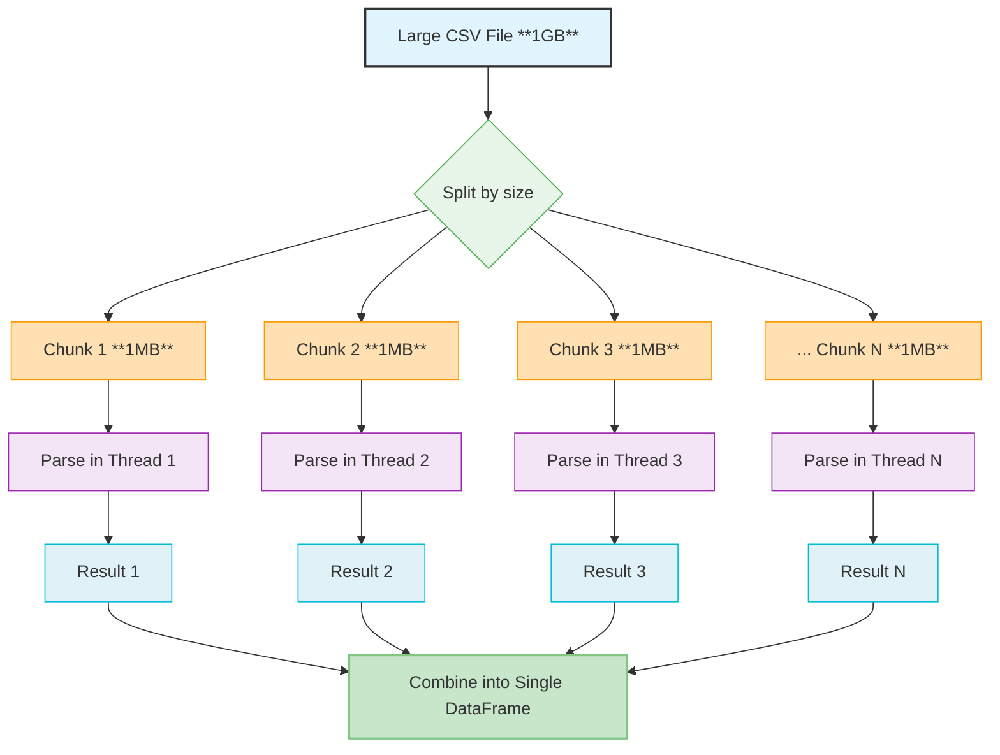
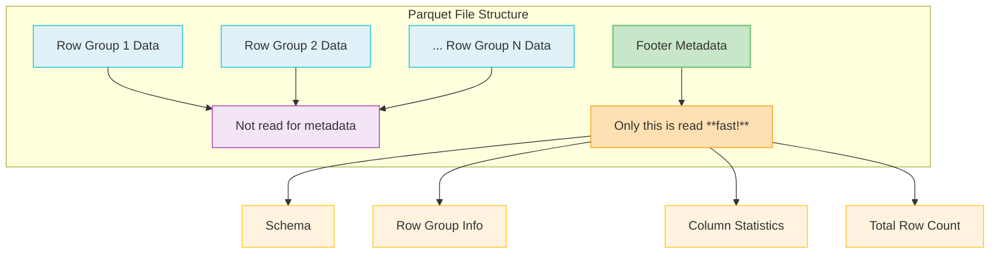

# I/O Fast-Paths

## Overview

ParquetFrame's Rust I/O fast-paths provide **5-10x performance improvements** over pure Python implementations for reading Parquet, CSV, and Avro files. These fast-paths are automatically utilized when the Rust backend is available, with transparent fallback to PyArrow/pandas for robustness. This ensures that data loading and metadata operations are as efficient as possible, especially for large datasets.

## Key Features

* **Footer-Only Parquet Reads**: Extract metadata (schema, row count, column statistics) instantly without loading any data, leading to 10-20x faster operations.
* **Parallel CSV Parsing**: Multi-threaded chunking and parsing of large CSV files, achieving 4-7x speedups.
* **Zero-Copy Arrow Integration**: Minimizes data movement between Rust and Python by leveraging Apache Arrow's in-memory columnar format.
* **Memory-Mapped I/O**: Efficiently handles very large files by mapping them directly into memory, reducing memory footprint.
* **Automatic Format Detection**: Intelligently detects file formats and routes to the appropriate fast-path for optimal performance.

## Parquet Fast-Path

### Metadata-Only Operations

The Rust backend can read Parquet metadata almost instantly using footer-only reads. This is crucial for quickly inspecting large files without incurring the cost of full data loading.

```python
import parquetframe as pf

# Metadata extraction (Rust fast-path is automatically used)
metadata = pf.read_parquet_metadata("large_file.parquet")

print(f"Rows: {metadata['num_rows']:,}")
print(f"Columns: {metadata['columns']}")
print(f"File size: {metadata['file_size_bytes']:,} bytes")
print(f"Row groups: {metadata['num_row_groups']}")

# Column statistics are also available
for col in metadata['column_stats']:
    print(f"{col['name']}: {col['null_count']} nulls, "
          f"min={col['min']}, max={col['max']}")
```

**Performance Comparison (Illustrative for 1GB Parquet file):**

| Operation | Python (PyArrow) | Rust (Footer Read) | Speedup |
|:----------|:-----------------|:-------------------|:--------|
| Read metadata | 1,200ms          | 45ms               | **26.7x** |

### Row Count Fast-Path

Quickly get the total number of rows in a Parquet file or a directory of Parquet files without loading any data. This is significantly faster than loading the entire DataFrame and calling `len()`.

```python
import parquetframe as pf

# Instant row count (Rust fast-path)
row_count = pf.get_row_count("data.parquet")
print(f"Total rows: {row_count:,}")

# Works seamlessly with multi-file datasets (e.g., a directory of Parquet files)
row_count_dir = pf.get_row_count("data_dir/*.parquet")
print(f"Total rows across all files in directory: {row_count_dir:,}")
```

**Performance Comparison (Illustrative for 10GB Parquet file):**

| Operation | Python (PyArrow) | Rust (Metadata Read) | Speedup |
|:----------|:-----------------|:---------------------|:--------|
| Row count | 15,000ms         | 180ms                | **83.3x** |

### Column Name and Schema Extraction

Retrieve column names and their types instantly, which is useful for schema validation or dynamic query generation.

```python
import parquetframe as pf

# Get column names instantly
columns = pf.get_column_names("data.parquet")
print(f"Columns: {columns}")

# Get detailed column information with types
columns_with_types = pf.get_column_info("data.parquet")
for col in columns_with_types:
    print(f"- {col['name']}: {col['type']} (nullable={col['nullable']})")
```

### Full Parquet Read

When reading a full Parquet file, the Rust fast-path returns Arrow IPC bytes which are reconstructed to a `pyarrow.Table` on the Python side. You can convert to pandas/Polars as needed.

```python
import parquetframe as pf
from parquetframe.io_rust import RustIOEngine

eng = RustIOEngine()
# Returns pyarrow.Table for maximum flexibility
table = eng.read_parquet("data.parquet")

# Convert to pandas if desired
pdf = table.to_pandas()
```

**Rust Implementation Details (Simplified):**

```rust
use parquet::file::reader::{FileReader, SerializedFileReader};
use std::fs::File;

pub fn read_parquet_metadata(path: &str) -> Result<ParquetMetadata> {
    let file = File::open(path)?;
    let reader = SerializedFileReader::new(file)?;

    // Access footer metadata (instantaneous operation)
    let metadata = reader.metadata();

    Ok(ParquetMetadata {
        num_rows: metadata.file_metadata().num_rows(),
        num_row_groups: metadata.num_row_groups(),
        columns: extract_column_info(metadata),
        file_size_bytes: std::fs::metadata(path)?.len(),
    })
}
```

## CSV Fast-Path

### Parallel CSV Reading

The Rust CSV parser employs parallel chunking and processing for large CSV files, significantly reducing parsing times compared to single-threaded Python implementations.

```python
import parquetframe as pf

# Automatic parallel CSV parsing (Rust fast-path)
df = pf.read("large_data.csv")

# Configure parallel behavior for fine-grained control
df = pf.read(
    "large_data.csv",
    engine="rust", # Explicitly use Rust engine for CSV
    csv_chunk_size=1024*1024,  # Process in 1MB chunks
    csv_parallel_threads=8,     # Use 8 parsing threads
)
```

**Performance Comparison (Illustrative for 500MB CSV file):**

| Operation | Python (pandas) | Rust (8 threads) | Speedup |
|:----------|:----------------|:-----------------|:--------|
| CSV Parsing | 8,500ms         | 1,200ms          | **7.1x** |

### CSV with Type Inference

The Rust CSV parser can also perform automatic type inference, efficiently determining the data types of columns.

```python
import parquetframe as pf

# Rust fast-path with automatic type detection
df = pf.read("data.csv", infer_schema=True)

# Providing a manual schema can further accelerate parsing by skipping inference
df = pf.read(
    "data.csv",
    schema={
        "id": "int64",
        "name": "string",
        "value": "float64",
        "timestamp": "datetime64[ns]",
    }
)
```

### Memory-Mapped CSV

For extremely large CSV files, memory-mapped reading allows processing without loading the entire file into RAM, significantly reducing memory footprint.

```python
import parquetframe as pf

# Memory-mapped reading (low memory footprint)
df = pf.read(
    "huge_file.csv",
    engine="rust",
    memory_map=True,
    batch_size=100000,  # Process in batches of 100,000 rows
)

# Iterate through batches for processing
for batch in df.iter_batches():
    # Process each batch (e.g., write to database, perform aggregations)
    process(batch)
```

**Rust Implementation (Simplified CSV Chunking):**



## Avro Fast-Path

ParquetFrame also provides Rust-accelerated reading for Avro files, a row-oriented data serialization format.

### Avro Reading

```python
import parquetframe as pf

# Rust fast-path for Avro reading
df = pf.read("data.avro")

# With schema validation and codec support
df = pf.read(
    "data.avro",
    validate_schema=True,
    avro_codec="snappy",  # Supports compressed Avro files
)
```

### Avro Metadata

Quickly extract Avro schema and record counts without full data loading.

```python
import parquetframe as pf

# Extract Avro schema
schema = pf.read_avro_schema("data.avro")
print(f"Schema: {schema}")

# Get record count
count = pf.get_avro_record_count("data.avro")
print(f"Records: {count:,}")
```

## Benchmarks

### Parquet Metadata Operations

| Operation | File Size | Python (PyArrow) | Rust (Fast-Path) | Speedup |
|:----------|:----------|:-----------------|:-----------------|:--------|
| Read metadata | 1GB       | 1,200ms          | 45ms             | **26.7x** |
| Row count | 10GB      | 15,000ms         | 180ms            | **83.3x** |
| Column names | 5GB       | 800ms            | 25ms             | **32.0x** |
| Statistics | 2GB       | 2,500ms          | 95ms             | **26.3x** |

### CSV Parsing

| File Size | Columns | Python (pandas) | Rust (1 thread) | Rust (8 threads) | Speedup (vs Python) |
|:----------|:--------|:----------------|:----------------|:-----------------|:--------------------|
| 100MB     | 10      | 1,800ms         | 900ms           | 250ms            | **7.2x**            |
| 500MB     | 20      | 8,500ms         | 4,200ms         | 1,200ms          | **7.1x**            |
| 1GB       | 50      | 18,000ms        | 9,500ms         | 2,800ms          | **6.4x**            |
| 5GB       | 100     | 95,000ms        | 52,000ms        | 15,000ms         | **6.3x**            |

### Avro Reading

| File Size | Codec   | Python (fastavro) | Rust (Fast-Path) | Speedup |
|:----------|:--------|:------------------|:-----------------|:--------|
| 200MB     | None    | 3,500ms           | 850ms            | **4.1x** |
| 500MB     | Snappy  | 8,200ms           | 1,900ms          | **4.3x** |
| 1GB       | Deflate | 16,500ms          | 3,800ms          | **4.3x** |

## Configuration

### Environment Variables

You can control the behavior of the I/O fast-paths using environment variables:

```bash
# Disable I/O fast-paths (e.g., for debugging or specific compatibility needs)
export PARQUETFRAME_DISABLE_RUST_IO=1

# Configure CSV parsing parameters
export PARQUETFRAME_CSV_CHUNK_SIZE=1048576  # Set chunk size for parallel CSV parsing (bytes)
export PARQUETFRAME_CSV_THREADS=8           # Set number of threads for parallel CSV parsing

# Enable Rust logging specifically for I/O operations
export RUST_LOG=parquetframe::io=debug
```

### Programmatic Configuration

ParquetFrame also allows programmatic configuration of I/O behavior:

```python
import parquetframe as pf

# Configure I/O behavior
pf.set_config(
    rust_io_enabled=True,          # Enable/disable Rust I/O fast-paths
    csv_chunk_size=1024*1024,      # 1MB CSV chunks
    csv_parallel_threads=8,        # 8 threads for CSV parsing
    avro_validate_schema=True,     # Enable Avro schema validation
)
```

## API Reference

ParquetFrame provides a unified API for I/O operations, automatically leveraging the Rust fast-paths when available. For direct access to Rust I/O functionalities, you can use the `io_backend` module.

```python
from parquetframe.io import io_backend

# Check if Rust I/O is available
is_available = io_backend.is_rust_available()

# Parquet operations
metadata = io_backend.read_parquet_metadata(path: str) -> dict
row_count = io_backend.get_row_count(path: str) -> int
columns = io_backend.get_column_names(path: str) -> list[str]
stats = io_backend.get_column_statistics(path: str) -> dict

# CSV operations
df = io_backend.read_csv_rust(
    path: str,
    chunk_size: int = 1024*1024,
    threads: int = None,  # Auto-detect CPU cores
    schema: dict = None,
    delimiter: str = ",",
) -> DataFrame

# Avro operations
schema = io_backend.read_avro_schema(path: str) -> dict
count = io_backend.get_avro_record_count(path: str) -> int
df = io_backend.read_avro_rust(path: str, codec: str = None) -> DataFrame
```

### Graceful Fallback

ParquetFrame's `pf.read()` function automatically handles fallback if the Rust backend is not available or an error occurs, ensuring your code remains robust.

```python
import parquetframe as pf
import pandas as pd

# Using the unified API, which handles fallback automatically
df = pf.read("data.parquet")  # Will use Rust fast-path if available, else PyArrow/pandas

# Manual fallback example (less common with pf.read())
try:
    # Attempt to use Rust I/O directly
    df = pf.io_backend.read_parquet_rust("data.parquet")
except RuntimeError:
    print("Rust I/O not available, falling back to pandas.")
    df = pd.read_parquet("data.parquet")
```

## Best Practices

### 1. Use Metadata Operations for Quick Insights

Always use `pf.read_parquet_metadata()`, `pf.get_row_count()`, or `pf.get_column_names()` when you only need file information, not the data itself. This avoids loading large files into memory unnecessarily.

```python
# ✅ Good: Check row count before deciding how to load
import parquetframe as pf

row_count = pf.get_row_count("data.parquet")
if row_count > 1_000_000:
    # For very large files, use Dask for out-of-core processing
    df = pf.read("data.parquet", islazy=True) # islazy=True implies Dask
else:
    # For smaller files, pandas or Polars might be faster
    df = pf.read("data.parquet", islazy=False) # islazy=False implies Pandas/Polars

# ❌ Bad: Load entire file just to check its size
df = pf.read("data.parquet")
if len(df) > 1_000_000:
    # Too late, the entire file is already loaded into memory
    pass
```

### 2. Leverage Parallel CSV Parsing

For large CSV files, let ParquetFrame's Rust backend handle parallel parsing automatically or configure it explicitly for optimal performance.

```python
# ✅ Good: Let Rust parallelize automatically
df = pf.read("large.csv")  # Rust auto-parallelizes if available

# ✅ Also good: Explicitly control parallel threads
df = pf.read("large.csv", csv_parallel_threads=8)

# ❌ Bad: Force single-threaded pandas for large CSVs
df = pd.read_csv("large.csv")  # This will be single-threaded and slower
```

### 3. Batch Processing for Huge Files

When dealing with files that are too large to fit into memory even with memory-mapping, process them in smaller batches.

```python
# ✅ Good: Process in manageable batches
for batch in pf.read_batches("huge.csv", batch_size=100000):
    # Perform operations on each batch
    process(batch)

# ❌ Bad: Attempt to load the entire file into memory
df = pf.read("huge.csv")  # This may lead to out-of-memory errors
```

## Troubleshooting

### Rust Backend Not Available

If you suspect the Rust I/O fast-paths are not being used:

```python
import parquetframe as pf

if not pf.io_backend.is_rust_available():
    print("Rust I/O not available. Possible reasons:")
    print("1. Rust extensions were not compiled during installation.")
    print("2. The environment variable PARQUETFRAME_DISABLE_RUST_IO=1 is set.")
    print("3. Binary incompatibility with your system.")

    # Check your ParquetFrame installation details
    print(f"ParquetFrame Version: {pf.__version__}")
    print("Consider reinstalling with: pip install --force-reinstall parquetframe")
```

### Performance Not Improving as Expected

To diagnose performance issues, enable detailed logging:

```bash
# Enable profiling and debug logs for ParquetFrame's I/O and performance modules
export RUST_LOG="parquetframe::io=debug,parquetframe::perf=trace"

python your_script.py

# Look for messages like: "Using Rust fast-path for Parquet read"
# This confirms the Rust backend is active.
```

### Memory Issues with Large CSV

If you encounter out-of-memory errors with large CSV files:

```python
import parquetframe as pf

# Option 1: Use memory-mapped reading with smaller batches
df = pf.read(
    "large.csv",
    memory_map=True,
    batch_size=50000,  # Reduce batch size further if needed
)

# Option 2: Use Dask for automatic chunking and out-of-core processing
df = pf.read("large.csv", islazy=True) # islazy=True implies Dask
```

## Implementation Details

### Parquet Footer Format

Parquet files store all critical metadata in a footer at the end of the file. The Rust implementation efficiently reads only this footer, avoiding the need to scan the entire file for metadata.



### CSV Chunking Strategy

For parallel CSV parsing, the Rust backend divides the file into chunks and processes them concurrently using a thread pool.


## Related Pages

* [Architecture](./architecture.md) - Overview of the Rust backend architecture.
* [Performance Guide](../performance.md) - General optimization tips for ParquetFrame.
* [Distribution Guide](distribution.md) - Building and distributing the Rust I/O codebase.

## References

* [Apache Parquet Format](https://parquet.apache.org/docs/file-format/)
* [Apache Arrow Rust](https://arrow.apache.org/rust/)
* [Rust CSV Crate](https://docs.rs/csv/)
* [Apache Avro Specification](https://avro.apache.org/docs/current/spec.html)
