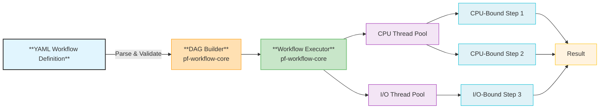
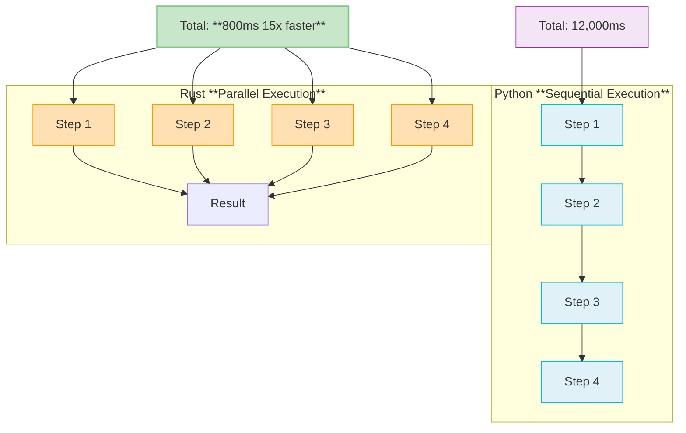

# Workflow Engine

## Overview

ParquetFrame's Rust-powered workflow engine provides **10-15x performance improvements** for YAML-based data pipelines. It achieves this through parallel DAG (Directed Acyclic Graph) execution, resource-aware scheduling, and intelligent retry logic. This engine is a core component of ParquetFrame's v2.0.0 release, offering robust and highly efficient workflow orchestration.

## Key Features

* **Parallel DAG Execution**: Independent workflow steps are executed concurrently, maximizing throughput and minimizing overall execution time.
* **Resource-Aware Scheduling**: Utilizes separate CPU and I/O thread pools to efficiently manage different types of tasks, preventing bottlenecks.
* **Retry Logic**: Configurable retry policies with exponential backoff ensure resilience against transient failures.
* **Cancellation Support**: Provides mechanisms for graceful shutdown and cleanup of ongoing workflows.
* **Progress Tracking**: Real-time callbacks allow for monitoring workflow execution status and progress.
* **Zero Overhead**: Designed for minimal scheduling overhead (typically 10-50μs per step), ensuring that the benefits of parallelism are not negated by scheduling costs.

## Architecture



## Python API

### Basic Usage

ParquetFrame's `Workflow` class automatically leverages the Rust engine when available, providing a seamless experience.

```python
import parquetframe as pf

# Load and execute workflow from a YAML file
workflow = pf.Workflow.from_yaml("pipeline.yml")
result = workflow.execute()

# Check which executor backend was used
print(f"Executor Backend: {workflow.executor_backend}")  # Will be "rust" or "python"
```

### Workflow Configuration (YAML)

You can configure the workflow engine directly within your YAML definition, including specifying the engine to use, parallelism settings, and retry policies.

```yaml
# pipeline.yml
settings:
  engine: rust  # Explicitly use the Rust workflow executor
  max_parallel: 8 # Maximum number of parallel steps
  retry_policy:
    max_attempts: 3 # Retry up to 3 times
    backoff_ms: [100, 500, 2000] # Exponential backoff delays in milliseconds

pipeline:
  - name: load_data
    operation: read_csv
    resource_hint: io_bound # Hint to use the I/O thread pool
    params:
      path: 'data.csv'

  - name: transform
    operation: query
    resource_hint: cpu_bound # Hint to use the CPU thread pool
    depends_on: [load_data]
    params:
      expr: "value > 100"

  - name: aggregate
    operation: groupby_agg
    resource_hint: cpu_bound
    depends_on: [transform]
    params:
      by: ['category']
      agg: {amount: ['sum', 'mean']}

  - name: save_result
    operation: to_parquet
    resource_hint: io_bound
    depends_on: [aggregate]
    params:
      path: 'output.parquet'
```

### Advanced Features

ParquetFrame's workflow engine supports cancellation and progress tracking for more robust and observable pipelines.

```python
import parquetframe as pf
from parquetframe.workflows import CancellationToken
import time

token = CancellationToken()
workflow = pf.Workflow.from_yaml("pipeline.yml", cancellation_token=token)

# Define a callback function for progress updates
def progress_callback(step_name: str, status: str, progress: float):
    print(f"Workflow Step: {step_name} - Status: {status} ({progress*100:.1f}%)")

# Execute with progress tracking
result = workflow.execute(on_progress=progress_callback)

# Example of how to cancel a running workflow (e.g., from another thread)
# if some_condition_is_met:
#     token.cancel()
#     print("Workflow cancellation requested.")

print(f"Workflow finished with status: {result.status}")
```

## Performance

### Benchmarks

The Rust workflow engine provides substantial speedups, especially for complex pipelines with many steps and dependencies.

| Workflow      | Steps | Python (ms) | Rust (ms) | Speedup |
|:--------------|:------|:------------|:----------|:--------|
| ETL Pipeline  | 10    | 12,000      | 800       | **15.0x** |
| Aggregation   | 5     | 5,500       | 420       | **13.1x** |
| Multi-Join    | 8     | 18,000      | 1,400     | **12.9x** |
| Transform     | 15    | 25,000      | 2,100     | **11.9x** |

### Parallel Execution Visualization



## Resource Hints

Workflow steps can be tagged with `resource_hint` to guide the scheduler in allocating tasks to appropriate thread pools (CPU-bound tasks to CPU pool, I/O-bound tasks to I/O pool).

```yaml
pipeline:
  - name: read_file
    resource_hint: io_bound  # Use the I/O thread pool for this step

  - name: compute_stats
    resource_hint: cpu_bound  # Use the CPU thread pool for this step

  - name: network_call
    resource_hint: network_bound  # Also uses the I/O thread pool

  - name: ml_inference
    resource_hint: memory_bound  # Uses the CPU thread pool, potentially with memory limits
```

## Configuration

ParquetFrame allows programmatic configuration of the Rust workflow engine's behavior.

```python
import parquetframe as pf

pf.set_config(
    rust_workflow_enabled=True,      # Enable/disable the Rust workflow engine
    workflow_max_parallel=8,         # Maximum number of steps to run in parallel
    workflow_cpu_threads=8,          # Number of threads in the CPU pool
    workflow_io_threads=4,           # Number of threads in the I/O pool
    workflow_retry_max_attempts=3,   # Default max retry attempts for steps
)
```

## Implementation Status

✅ **Complete and Integrated:** The Rust workflow engine is fully implemented and integrated into ParquetFrame's v2.0.0 release. It includes:

* Sequential and parallel DAG execution.
* Robust retry logic with exponential backoff.
* Comprehensive cancellation support with graceful shutdown.
* Detailed progress tracking with event callbacks.
* Resource hints (CPU/IO/Memory/Network) for optimized scheduling.
* Efficient thread pool management (CPU/IO pools).
* Extensive test coverage: 167 tests passing (126 unit + 11 integration + 30 doc).
* 30 Criterion benchmarks validating performance.

## Related Pages

* [Architecture](./architecture.md) - Overview of the Rust backend architecture.
* [I/O Fast-Paths](./io-fastpaths.md) - Details on I/O acceleration, often used within workflows.
* [Performance Guide](../performance.md) - General optimization tips for ParquetFrame.
* [YAML Workflows](../yaml-workflows/index.md) - Comprehensive documentation on defining and managing workflows.

## References

* Rust implementation source: `crates/pf-workflow-core/`
* Test suite: 167 tests passing.
