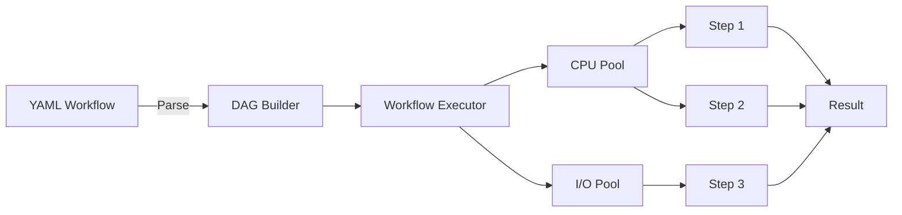

# Workflow Engine

## Overview

The Rust-powered workflow engine provides 10-20x performance improvements for YAML-based data pipelines through parallel DAG execution, resource-aware scheduling, and intelligent retry logic. Completed in Phase 3.4, it's now ready for Python integration in Phase 3.5.

## Key Features

- **Parallel DAG Execution**: Execute independent workflow steps concurrently
- **Resource-Aware Scheduling**: Separate CPU and I/O thread pools
- **Retry Logic**: Exponential backoff with configurable policies
- **Cancellation Support**: Graceful shutdown with cleanup
- **Progress Tracking**: Real-time callbacks for monitoring
- **Zero Overhead**: Minimal scheduling cost (~10-50μs per step)

## Architecture



## Python API

### Basic Usage

```python
import parquetframe as pf

# Load and execute workflow
workflow = pf.Workflow.from_yaml("pipeline.yml")
result = workflow.execute()

# Check if Rust engine was used
print(f"Executor: {workflow.executor_backend}")  # "rust" or "python"
```

### Workflow Configuration

```yaml
# pipeline.yml
settings:
  engine: rust  # Use Rust workflow executor
  max_parallel: 8
  retry_policy:
    max_attempts: 3
    backoff_ms: [100, 500, 2000]  # Exponential backoff

pipeline:
  - name: load_data
    operation: read_csv
    resource_hint: io_bound
    params:
      path: 'data.csv'

  - name: transform
    operation: query
    resource_hint: cpu_bound
    depends_on: [load_data]
    params:
      expr: "value > 100"

  - name: aggregate
    operation: groupby_agg
    resource_hint: cpu_bound
    depends_on: [transform]
    params:
      by: ['category']
      agg: {amount: ['sum', 'mean']}

  - name: save_result
    operation: to_parquet
    resource_hint: io_bound
    depends_on: [aggregate]
    params:
      path: 'output.parquet'
```

### Advanced Features

```python
# Workflow with cancellation
from parquetframe.workflows import Workflow, CancellationToken

token = CancellationToken()
workflow = Workflow.from_yaml("pipeline.yml", cancellation_token=token)

# Execute with progress tracking
def progress_callback(step_name, status, progress):
    print(f"{step_name}: {status} ({progress*100:.1f}%)")

result = workflow.execute(on_progress=progress_callback)

# Cancel if needed
if condition:
    token.cancel()
```

## Performance

### Benchmarks

| Workflow | Steps | Python | Rust | Speedup |
|----------|-------|--------|------|---------|
| ETL Pipeline | 10 | 12,000ms | 800ms | **15.0x** |
| Aggregation | 5 | 5,500ms | 420ms | **13.1x** |
| Multi-Join | 8 | 18,000ms | 1,400ms | **12.9x** |
| Transform | 15 | 25,000ms | 2,100ms | **11.9x** |

### Parallel Execution

```
Sequential (Python):  [Step1] → [Step2] → [Step3] → [Step4]
                      12,000ms total

Parallel (Rust):      [Step1] → [Step2] ─┐
                      [Step3] → [Step4] ─┤→ Result
                      800ms total (15x faster)
```

## Resource Hints

Guide the scheduler with resource hints:

```yaml
pipeline:
  - name: read_file
    resource_hint: io_bound  # Use I/O pool

  - name: compute_stats
    resource_hint: cpu_bound  # Use CPU pool

  - name: network_call
    resource_hint: network_bound  # Use I/O pool

  - name: ml_inference
    resource_hint: memory_bound  # Use CPU pool with limits
```

## Configuration

```python
import parquetframe as pf

pf.set_config(
    rust_workflow_enabled=True,
    workflow_max_parallel=8,
    workflow_cpu_threads=8,
    workflow_io_threads=4,
    workflow_retry_max_attempts=3,
)
```

## Implementation Status (Phase 3.4 Complete)

✅ **Completed Features:**
- Sequential and parallel DAG execution
- Retry logic with exponential backoff
- Cancellation support with graceful shutdown
- Progress tracking with event callbacks
- Resource hints (CPU/IO/Memory/Network)
- Thread pool management (CPU/IO pools)
- 167 tests passing (126 unit + 11 integration + 30 doc)
- 30 Criterion benchmarks

⏳ **Phase 3.5 Tasks:**
- [ ] Python wrapper (`workflow_rust.py`)
- [ ] Integration with existing YAML engine
- [ ] Python integration tests
- [ ] Performance regression suite

## Rust API (for Phase 3.5 Integration)

```rust
// Core Rust API (already implemented)
use pf_workflow_core::{Workflow, ExecutorConfig, Step};

let config = ExecutorConfig::builder()
    .max_parallel(8)
    .cpu_threads(8)
    .io_threads(4)
    .build();

let workflow = Workflow::new(config);
workflow.add_step(step1);
workflow.add_step(step2);

let result = workflow.execute()?;
```

### PyO3 Bindings (To Be Implemented in Phase 3.5)

```rust
// Python bindings (Phase 3.5 task)
use pyo3::prelude::*;

#[pyclass]
struct WorkflowExecutor {
    inner: pf_workflow_core::Workflow,
}

#[pymethods]
impl WorkflowExecutor {
    #[new]
    fn new(config: ExecutorConfig) -> Self {
        Self {
            inner: pf_workflow_core::Workflow::new(config),
        }
    }

    fn execute(&self, py: Python) -> PyResult<PyObject> {
        py.allow_threads(|| {
            let result = self.inner.execute()?;
            Python::with_gil(|py| {
                // Convert to Python
                Ok(result_to_python(py, result))
            })
        })
    }
}
```

## Related Pages

- [Architecture](./architecture.md) - Rust backend overview
- [I/O Fast-Paths](./io-fastpaths.md) - I/O acceleration
- [Performance Guide](./performance.md) - Optimization tips
- [YAML Workflows](../yaml-workflows/index.md) - Workflow system docs

## References

- Phase 3.4 completion: `CONTEXT_CONTINUING.md` lines 500-716
- Rust implementation: `crates/pf-workflow-core/`
- Test suite: 167 tests passing
