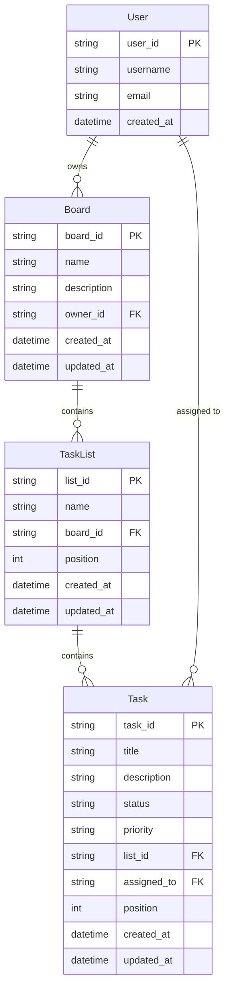
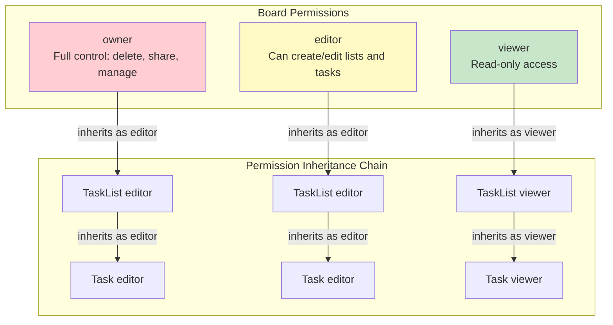

# Todo/Kanban Application - Complete Walkthrough

> A comprehensive guide to building a multi-user Kanban board system using ParquetFrame's Phase 2 features

## Overview

This tutorial walks through a complete **Todo/Kanban application** that demonstrates all major Phase 2 features:

- ✅ **Entity Framework** with `@entity` and `@rel` decorators
- ✅ **Zanzibar Permissions** (all 4 core APIs)
- ✅ **Multi-User Collaboration** with role-based access control
- ✅ **Permission Inheritance** (Board → List → Task)
- ✅ **YAML Workflows** for ETL pipelines
- ✅ **Persistent Storage** using Parquet backend

### What You'll Build

A production-ready Kanban board system supporting:

- **Multi-user teams** with owner, editor, and viewer roles
- **Permission inheritance** that cascades from boards to lists to tasks
- **Task management** with status tracking and assignments
- **Workflow automation** for importing/exporting task data
- **Graph-based permissions** using Zanzibar ReBAC

---

## Architecture

### Entity Relationship Diagram



**Permission Graph Integration:**

The Zanzibar permission system creates a separate graph layer that manages access control:

- Board permissions cascade to TaskLists and Tasks
- Users inherit permissions through group membership
- Permission checks traverse the graph for indirect access

### Permission Model

The application implements **Zanzibar-style Relationship-Based Access Control (ReBAC)**:



---

## Setup & Installation

### Prerequisites

```bash
# Install ParquetFrame with Phase 2 support
pip install parquetframe[phase2]

# Or install from source
pip install -e /path/to/parquetframe
```

### Project Structure

```
examples/integration/todo_kanban/
├── __init__.py           # Package exports
├── models.py             # Entity definitions (178 lines)
├── permissions.py        # Zanzibar permission system (512 lines)
├── app.py                # Main application class (600+ lines)
├── demo.py               # Interactive demo (393 lines)
├── README.md             # Documentation (609 lines)
├── workflows/
│   ├── import_tasks.yml    # CSV/JSON import ETL (93 lines)
│   ├── export_report.yml   # Report generation (195 lines)
│   └── task_analytics.yml  # Analytics pipeline (325 lines)
└── data/
    ├── sample_tasks.csv    # Sample CSV data (30 tasks)
    └── sample_tasks.json   # Sample JSON data (10 tasks)
```

### Running the Demo

```bash
cd examples/integration/todo_kanban
python demo.py
```

The demo will:

1. Create three users (Alice, Bob, Charlie)
2. Create a board with lists (Todo, In Progress, Done)
3. Create and assign tasks
4. Demonstrate permission inheritance
5. Show all 4 Zanzibar permission APIs
6. Demonstrate task state transitions
7. Show permission revocation effects

---

## Entity Framework Deep Dive

### The @entity Decorator

The `@entity` decorator transforms a dataclass into a persistent entity with automatic CRUD operations:

```python path=/Users/temp/Documents/Projects/parquetframe/examples/integration/todo_kanban/models.py start=19

@entity(storage_path="./kanban_data/users", primary_key="user_id")
@dataclass
class User:
    """User entity representing an application user."""

    user_id: str
    username: str
    email: str
    created_at: datetime = None

    def __post_init__(self):
        """Initialize created_at if not provided."""
        if self.created_at is None:
            self.created_at = datetime.now()

    @rel("Board", foreign_key="owner_id", reverse=True)
    def boards(self):
        """Get all boards owned by this user."""
        pass
```

**What the `@entity` decorator provides:**

- `user.save()` - Persist to Parquet storage
- `User.find(user_id)` - Load by primary key
- `User.find_all()` - Query all users
- `User.find_by(username="alice")` - Query with filters
- `user.delete()` - Remove from storage
- `User.count()` - Count total entities

### Entity Model: User

```python path=null start=null
from dataclasses import dataclass
from datetime import datetime
from parquetframe.entity import entity, rel

@entity(storage_path="./kanban_data/users", primary_key="user_id")
@dataclass
class User:
    user_id: str
    username: str
    email: str
    created_at: datetime = None

    def __post_init__(self):
        if self.created_at is None:
            self.created_at = datetime.now()

    @rel("Board", foreign_key="owner_id", reverse=True)
    def boards(self):
        """Get all boards owned by this user."""
        pass
```

**Usage:**

```python path=null start=null
# Create and save
user = User(user_id="user_001", username="alice", email="alice@example.com")
user.save()

# Retrieve
user = User.find("user_001")
print(user.username)  # "alice"

# Query
all_users = User.find_all()
alice_users = User.find_by(username="alice")

# Relationship traversal
boards = user.boards()  # Get all boards owned by alice
```

### Entity Model: Board

```python path=/Users/temp/Documents/Projects/parquetframe/examples/integration/todo_kanban/models.py start=51
@entity(storage_path="./kanban_data/boards", primary_key="board_id")
@dataclass
class Board:
    """Board entity representing a kanban board."""

    board_id: str
    name: str
    description: str
    owner_id: str  # Foreign key to User
    created_at: datetime = None
    updated_at: datetime = None

    def __post_init__(self):
        now = datetime.now()
        if self.created_at is None:
            self.created_at = now
        if self.updated_at is None:
            self.updated_at = now

    @rel("User", foreign_key="owner_id")
    def owner(self):
        """Get the user who owns this board."""
        pass

    @rel("TaskList", foreign_key="board_id", reverse=True)
    def lists(self):
        """Get all task lists in this board."""
        pass
```

### Entity Model: TaskList

```python path=/Users/temp/Documents/Projects/parquetframe/examples/integration/todo_kanban/models.py start=96
@entity(storage_path="./kanban_data/lists", primary_key="list_id")
@dataclass
class TaskList:
    """TaskList entity representing a list/column in a board."""

    list_id: str
    name: str              # e.g., "Todo", "In Progress", "Done"
    board_id: str          # Foreign key to Board
    position: int = 0      # Display order
    created_at: datetime = None
    updated_at: datetime = None

    @rel("Board", foreign_key="board_id")
    def board(self):
        """Get the board this list belongs to."""
        pass

    @rel("Task", foreign_key="list_id", reverse=True)
    def tasks(self):
        """Get all tasks in this list."""
        pass
```

### Entity Model: Task

```python path=/Users/temp/Documents/Projects/parquetframe/examples/integration/todo_kanban/models.py start=141
@entity(storage_path="./kanban_data/tasks", primary_key="task_id")
@dataclass
class Task:
    """Task entity representing an individual task."""

    task_id: str
    title: str
    description: str
    status: str = "todo"          # todo, in_progress, done
    priority: str = "medium"       # low, medium, high
    list_id: str = ""             # Foreign key to TaskList
    assigned_to: str | None = None  # Optional foreign key to User
    position: int = 0
    created_at: datetime = None
    updated_at: datetime = None

    def __post_init__(self):
        now = datetime.now()
        if self.created_at is None:
            self.created_at = now
        if self.updated_at is None:
            self.updated_at = now

        # Validate status and priority
        if self.status not in ["todo", "in_progress", "done"]:
            raise ValueError(f"Invalid status: {self.status}")
        if self.priority not in ["low", "medium", "high"]:
            raise ValueError(f"Invalid priority: {self.priority}")

    @rel("TaskList", foreign_key="list_id")
    def list(self):
        """Get the list this task belongs to."""
        pass

    @rel("User", foreign_key="assigned_to")
    def assigned_user(self):
        """Get the user assigned to this task."""
        pass
```

---

## The @rel Decorator - Relationship Definition

The `@rel` decorator defines relationships between entities, enabling relationship traversal and foreign key resolution.

### Forward Relationships (Many-to-One)

```python path=null start=null
@entity(storage_path="./kanban_data/boards", primary_key="board_id")
@dataclass
class Board:
    owner_id: str  # Foreign key

    @rel("User", foreign_key="owner_id")
    def owner(self):
        """Get the user who owns this board."""
        pass

# Usage
board = Board.find("board_001")
owner_user = board.owner()  # Returns User entity
print(owner_user.username)
```

### Reverse Relationships (One-to-Many)

```python path=null start=null
@entity(storage_path="./kanban_data/users", primary_key="user_id")
@dataclass
class User:
    user_id: str

    @rel("Board", foreign_key="owner_id", reverse=True)
    def boards(self):
        """Get all boards owned by this user."""
        pass

# Usage
user = User.find("user_001")
owned_boards = user.boards()  # Returns list[Board]
for board in owned_boards:
    print(board.name)
```

### Bi-directional Relationships

```python path=null start=null
# User → Board (reverse)
user = User.find("user_001")
boards = user.boards()

# Board → User (forward)
board = Board.find("board_001")
owner = board.owner()
```

---

## Zanzibar Permissions System

The application implements Google's Zanzibar permission model with all 4 core APIs.

### Permission Model Structure

```python path=null start=null
# Grant permission
app.permissions.grant_board_access(user_id, board_id, "owner")

# Permission tuple stored as:
RelationTuple(
    resource_type="board",
    resource_id=board_id,
    relation="owner",
    subject_type="user",
    subject_id=user_id
)
```

### API 1: check() - Verify Single Permission

Check if a user has a specific permission on a resource.

```python path=null start=null
# Check board access
has_access = app.permissions.check_board_access(
    user_id="user_alice",
    board_id="board_001",
    relation="editor"
)
# Returns: True or False

# Check with inheritance
has_task_access = app.permissions.check_task_access(
    user_id="user_bob",
    task_id="task_123",
    list_id="list_456",
    board_id="board_001",
    relation="viewer"
)
# Checks: Direct permission OR inherited from list OR inherited from board
```

**Example from Demo:**

```python path=/Users/temp/Documents/Projects/parquetframe/examples/integration/todo_kanban/demo.py start=169
# Checking board permissions
alice_owner = app.permissions.check_board_access(
    alice.user_id, board.board_id, "owner"
)
print(f"Alice owner access: {alice_owner} ✓")

bob_editor = app.permissions.check_board_access(
    bob.user_id, board.board_id, "editor"
)
print(f"Bob editor access: {bob_editor} ✓")

charlie_viewer = app.permissions.check_board_access(
    charlie.user_id, board.board_id, "viewer"
)
print(f"Charlie viewer access: {charlie_viewer} ✓")
```

### API 2: expand() - Explore Permission Trees

Get the full permission tree showing how a user got access to a resource.

```python path=null start=null
# Expand board permissions
tree = app.permissions.expand_board_permissions(board_id="board_001", relation="editor")

# Returns permission tree structure:
{
    "resource": "board:board_001#editor",
    "users": ["user_alice", "user_bob"],
    "inherited_from": {
        "board:board_001#owner": ["user_alice"]
    }
}
```

### API 3: list_objects() - Find Accessible Resources

List all resources of a type that a user can access.

```python path=null start=null
# List all boards a user can access
accessible_boards = app.permissions.list_user_permissions(
    user_id="user_bob",
    resource_type="board"
)
# Returns: [(relation, resource_id), ...]
# Example: [("editor", "board_001"), ("viewer", "board_002")]

# Get full Board entities
boards = []
for relation, board_id in accessible_boards:
    board = Board.find(board_id)
    if board:
        boards.append(board)
```

### API 4: list_subjects() - Find Who Has Access

List all users who have a specific permission on a resource.

```python path=null start=null
# List all editors of a board
editors = app.permissions.list_resource_permissions(
    resource_type="board",
    resource_id="board_001",
    relation="editor"
)
# Returns: [(subject_type, subject_id), ...]
# Example: [("user", "user_alice"), ("user", "user_bob")]
```

### Permission Inheritance Example

```python path=null start=null
# 1. Grant board access
app.permissions.grant_board_access(user_id="user_bob", board_id="board_001", role="editor")

# 2. Create list - automatically inherits board permissions
task_list = app.add_list(board_id="board_001", user_id="user_alice", name="Todo", position=0)

# 3. Bob can now access the list (inherited from board)
can_edit_list = app.permissions.check_list_access(
    user_id="user_bob",
    list_id=task_list.list_id,
    board_id="board_001",
    relation="editor"
)
# Returns: True (inherited from board editor permission)

# 4. Create task - automatically inherits list permissions
task = app.create_task(
    list_id=task_list.list_id,
    user_id="user_alice",
    title="Setup database",
    description="Configure PostgreSQL"
)

# 5. Bob can access the task (inherited through board → list → task chain)
can_view_task = app.permissions.check_task_access(
    user_id="user_bob",
    task_id=task.task_id,
    list_id=task_list.list_id,
    board_id="board_001",
    relation="viewer"
)
# Returns: True
```

---

## Multi-User Collaboration Scenarios

### Scenario 1: Creating and Sharing a Board

```python path=/Users/temp/Documents/Projects/parquetframe/examples/integration/todo_kanban/demo.py start=77
# Step 1: Create users
alice = app.create_user("alice", "alice@example.com")
bob = app.create_user("bob", "bob@example.com")
charlie = app.create_user("charlie", "charlie@example.com")

# Step 2: Alice creates a board
board = app.create_board(
    alice.user_id,
    "Project Alpha",
    "Sprint board for Project Alpha development"
)
# Automatically grants alice "owner" permission

# Step 3: Alice shares board with team
app.share_board(board.board_id, alice.user_id, bob.user_id, "editor")
# Bob can: create/edit lists and tasks, view everything
# Bob cannot: delete board, manage permissions

app.share_board(board.board_id, alice.user_id, charlie.user_id, "viewer")
# Charlie can: view board, lists, and tasks
# Charlie cannot: create/edit/delete anything
```

### Scenario 2: Task Assignment and State Transitions

```python path=null start=null
# Alice creates a task and assigns to Bob
task = app.create_task(
    list_id=todo_list.list_id,
    user_id=alice.user_id,
    title="Setup database",
    description="Configure PostgreSQL with proper schema",
    priority="high",
    assigned_to=bob.user_id  # Assigned to Bob
)

# Bob moves task to "In Progress"
app.update_task_status(
    task_id=task.task_id,
    user_id=bob.user_id,
    new_status="in_progress"
)

# Bob completes the task
app.update_task_status(
    task_id=task.task_id,
    user_id=bob.user_id,
    new_status="done"
)

# Move task to "Done" list
app.move_task(
    task_id=task.task_id,
    user_id=bob.user_id,
    new_list_id=done_list.list_id
)
```

### Scenario 3: Permission Revocation

```python path=null start=null
# Revoke Bob's editor access
app.permissions.revoke_board_access(bob.user_id, board.board_id, "editor")

# Bob now loses access to:
# - Board editor permissions
# - All list editor permissions (inherited)
# - All task editor permissions (inherited)

# Bob can still access via other permissions (e.g., task assignee)
task_assignee_access = app.permissions.check_task_access(
    bob.user_id, task.task_id, list_id, board_id, "editor"
)
# Returns: True if Bob is assigned to the task
```

---

## YAML Workflows - ETL Pipelines

### Workflow 1: Import Tasks from CSV/JSON

```yaml path=/Users/temp/Documents/Projects/parquetframe/examples/integration/todo_kanban/workflows/import_tasks.yml start=1
name: "Import Tasks from External Sources"
description: "ETL workflow to import tasks from CSV or JSON files with validation"

variables:
  source_file: "data/sample_tasks.csv"
  source_format: "csv"  # csv or json
  target_list_id: "list_001"
  user_id: "user_001"
  storage_path: "./kanban_data/tasks"

steps:
  # Step 1: Read source data
  - name: "read_source"
    type: "read"
    input: "${source_file}"
    output: "raw_tasks"

  # Step 2: Validate required fields
  - name: "validate_required_fields"
    type: "filter"
    input: "raw_tasks"
    query: "task_id.notna() and title.notna()"
    output: "validated_tasks"

  # Step 3: Transform to schema
  - name: "transform_to_schema"
    type: "select"
    input: "validated_tasks"
    columns:
      task_id: "task_id"
      title: "title"
      description: "description"
      status: "status"
      priority: "priority"
    output: "schema_tasks"

  # Step 4: Validate enums
  - name: "validate_enums"
    type: "filter"
    input: "schema_tasks"
    query: "status.isin(['todo', 'in_progress', 'done', 'blocked'])"
    output: "valid_tasks"

  # Step 5: Save to storage
  - name: "save_tasks"
    type: "save"
    input: "valid_tasks"
    output: "${storage_path}/imported_tasks.parquet"
```

**Usage:**

```bash
pframe workflow run import_tasks.yml \
  --var source_file=data/new_tasks.csv \
  --var target_list_id=list_todo_001
```

### Workflow 2: Export Task Report

```yaml path=/Users/temp/Documents/Projects/parquetframe/examples/integration/todo_kanban/workflows/export_report.yml start=1
name: "Export Task Report"
description: "Generate comprehensive task reports with filtering and aggregations"

variables:
  tasks_path: "./kanban_data/tasks"
  users_path: "./kanban_data/users"
  output_csv: "reports/task_report.csv"
  filter_status: ""  # Optional filter
  filter_priority: ""  # Optional filter

steps:
  # Load data
  - name: "load_tasks"
    type: "read"
    input: "${tasks_path}"
    output: "tasks"

  - name: "load_users"
    type: "read"
    input: "${users_path}"
    output: "users"

  # Filter by status and priority
  - name: "filter_by_status"
    type: "filter"
    input: "tasks"
    query: "status == '${filter_status}' or '${filter_status}' == ''"
    output: "status_filtered"

  - name: "filter_by_priority"
    type: "filter"
    input: "status_filtered"
    query: "priority == '${filter_priority}' or '${filter_priority}' == ''"
    output: "filtered_tasks"

  # Aggregate statistics
  - name: "aggregate_by_status"
    type: "groupby"
    input: "filtered_tasks"
    by: ["status"]
    agg:
      task_id: "count"
      priority: "nunique"
    output: "status_summary"

  # Save outputs
  - name: "save_csv_report"
    type: "save"
    input: "filtered_tasks"
    output: "${output_csv}"

  - name: "save_summary"
    type: "save"
    input: "status_summary"
    output: "reports/summary_by_status.parquet"
```

**Usage:**

```bash
pframe workflow run export_report.yml \
  --var filter_status=in_progress \
  --var output_csv=reports/active_tasks.csv
```

---

## Running the Application

### Basic Usage Example

```python path=null start=null
from examples.integration.todo_kanban import TodoKanbanApp

# Initialize
app = TodoKanbanApp(storage_base="./kanban_data")

# Create users
alice = app.create_user("alice", "alice@example.com")
bob = app.create_user("bob", "bob@example.com")

# Alice creates board
board = app.create_board(alice.user_id, "My Project", "Sprint board")

# Add lists
todo = app.add_list(board.board_id, alice.user_id, "Todo", 0)
progress = app.add_list(board.board_id, alice.user_id, "In Progress", 1)
done = app.add_list(board.board_id, alice.user_id, "Done", 2)

# Create task
task = app.create_task(
    list_id=todo.list_id,
    user_id=alice.user_id,
    title="Setup project",
    description="Initialize repository",
    priority="high",
    assigned_to=bob.user_id
)

# Share board
app.share_board(board.board_id, alice.user_id, bob.user_id, "editor")

# Bob updates task
app.update_task_status(task.task_id, bob.user_id, "in_progress")
```

---

## Advanced Features

### Custom Permission Rules

```python path=null start=null
# Grant direct task access (bypassing board permissions)
app.permissions.grant_direct_task_access(
    user_id="user_charlie",
    task_id="task_123",
    relation="editor"
)

# This allows Charlie to edit task_123 even if he doesn't
# have board or list permissions
```

### Bulk Operations

```python path=null start=null
# Bulk task creation
tasks_data = [
    {"title": "Task 1", "description": "...", "priority": "high"},
    {"title": "Task 2", "description": "...", "priority": "medium"},
    {"title": "Task 3", "description": "...", "priority": "low"},
]

for data in tasks_data:
    task = app.create_task(
        list_id=todo_list.list_id,
        user_id=alice.user_id,
        **data
    )
```

### Performance Considerations

```python path=null start=null
# Use batch queries to reduce I/O
all_tasks = Task.find_all()  # Single I/O operation

# Filter in memory instead of multiple find() calls
urgent_tasks = [t for t in all_tasks if t.priority == "high"]

# Use permissions list_objects for bulk permission checks
accessible_boards = app.permissions.list_user_permissions(
    user_id=user.user_id,
    resource_type="board"
)
```

---

## Key Takeaways

This Todo/Kanban application demonstrates:

1. **Entity Framework** - Declarative persistence with `@entity` and `@rel`
2. **Zanzibar Permissions** - Complete ReBAC implementation with all 4 APIs
3. **Permission Inheritance** - Automatic propagation through resource hierarchy
4. **Multi-User Collaboration** - Role-based access control for team workflows
5. **YAML Workflows** - ETL pipelines for data import/export
6. **Production Patterns** - Validation, error handling, and performance optimization

### Next Steps

- **Explore the Code**: Check out `examples/integration/todo_kanban/`
- **Run the Demo**: `python examples/integration/todo_kanban/demo.py`
- **Read the Source**: Study `models.py`, `permissions.py`, `app.py`
- **Build Your Own**: Use this as a template for your application
- **Check Documentation**: [Phase 2 Guide](../phase2/README.md)

---

## Related Documentation

- **[Phase 2 Overview](../phase2/README.md)** - Phase 2 architecture and features
- **[Entity Framework Guide](../phase2/entities.md)** - Complete @entity documentation
- **[Relationship Guide](../phase2/relationships.md)** - @rel decorator and patterns
- **[Permissions System](../user-guide/permissions.md)** - Zanzibar permission details
- **[Workflow System](../user-guide/workflows.md)** - YAML workflow reference
- **[Migration Guide](../getting-started/migration.md)** - Migrate from Phase 1

---

**Questions or Issues?** [Open an issue on GitHub](https://github.com/leechristophermurray/parquetframe/issues)
