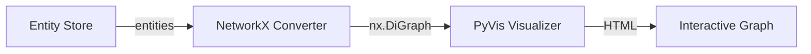

# Visualization

ParquetFrame provides a high-level API for visualizing your entity graphs and data structures.

## Entity Graph Visualization

The `visualize_store` function allows you to easily generate interactive visualizations of your entity store using PyVis.

### Usage

```python
from parquetframe.visualization import visualize_store
from parquetframe.entity import entity

# Visualize all entities in the store
visualize_store(output_path="entity_graph.html")

# Visualize specific entity types
visualize_store(
    output_path="user_graph.html",
    entity_types=["User", "Post"]
)
```

### Features

- **Interactive**: Generates HTML files with zoom, pan, and drag capabilities.
- **Relationship Traversal**: Automatically visualizes relationships between entities.
- **Customizable**: Supports filtering by entity type.

## Architecture

The visualization module wraps **NetworkX** for graph construction and **PyVis** for rendering.


