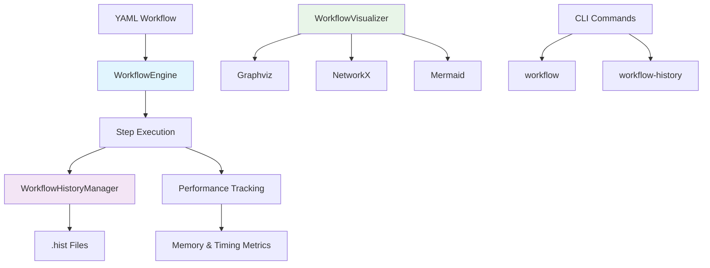

# Workflow System

ParquetFrame's workflow system provides powerful orchestration capabilities for complex data processing pipelines. Build, execute, monitor, and visualize multi-step data transformations with enterprise-grade features.

## ✨ Key Features

- **📄 YAML-based Workflow Definitions** - Define complex pipelines in readable YAML format
- **🔄 Step Dependencies** - Automatic dependency resolution and execution ordering
- **📊 Execution History** - Track all workflow runs with detailed metrics
- **📈 Performance Analytics** - Monitor execution times, memory usage, and success rates
- **🎯 DAG Visualization** - Generate visual representations of workflow dependencies
- **🛠️ Rich CLI Tools** - Comprehensive command-line interface for management
- **⚡ Backend Optimization** - Automatic pandas/Dask selection based on data size

## 🚀 Quick Start

### 1. Create a Workflow

```yaml title="data_pipeline.yml"
name: "Customer Data Pipeline"
description: "Process customer data and generate insights"

steps:
  - name: "load_customers"
    type: "read"
    input: "raw_customers.parquet"
    output: "customers"

  - name: "filter_active"
    type: "filter"
    input: "customers"
    query: "status == 'active' and last_login > '2024-01-01'"
    output: "active_customers"

  - name: "add_segments"
    type: "transform"
    input: "active_customers"
    function: "add_customer_segments"
    output: "segmented_customers"

  - name: "save_results"
    type: "save"
    input: "segmented_customers"
    output: "customer_segments.parquet"
```

### 2. Execute the Workflow

```bash
# Run the workflow
pframe workflow data_pipeline.yml

# Run with variables
pframe workflow data_pipeline.yml --variables "min_revenue=1000,region=US"

# Validate before running
pframe workflow data_pipeline.yml --validate

# Generate visualization
pframe workflow data_pipeline.yml --visualize graphviz --viz-output pipeline.svg
```

### 3. Monitor Execution History

```bash
# View recent executions
pframe workflow-history

# Filter by workflow
pframe workflow-history --workflow-name "Customer Data Pipeline"

# Show detailed information
pframe workflow-history --details

# View statistics
pframe workflow-history --stats
```

## 🏗️ Architecture Overview



## 📖 Documentation Sections

| Section | Description |
|---------|-------------|
| **[Step Types](step-types.md)** | Complete reference for all available workflow step types |
| **[YAML Syntax](yaml-syntax.md)** | Detailed workflow definition format and options |
| **[CLI Commands](cli-commands.md)** | Command-line interface reference for workflow management |
| **[History & Analytics](history-analytics.md)** | Execution tracking, metrics, and performance analysis |
| **[DAG Visualization](visualization.md)** | Generate and customize workflow visualizations |
| **[Advanced Features](advanced.md)** | Variables, conditionals, and complex dependency patterns |
| **[Examples](examples.md)** | Real-world workflow examples and use cases |

## 🎯 Common Use Cases

### Data Processing Pipeline
Perfect for ETL/ELT workflows with multiple transformation steps, filtering, and aggregation operations.

### Machine Learning Workflows
Orchestrate data preprocessing, feature engineering, model training, and evaluation steps.

### Business Intelligence
Automate report generation, metric calculations, and dashboard data preparation.

### Data Quality Monitoring
Create repeatable data validation and quality assessment workflows.

## 🚀 Getting Started

Ready to build your first workflow? Start with our [Step Types Reference](step-types.md) to understand available operations, then explore [YAML Syntax](yaml-syntax.md) for workflow definitions.

For hands-on examples, check out our [Examples Gallery](examples.md) featuring real-world use cases and patterns.
