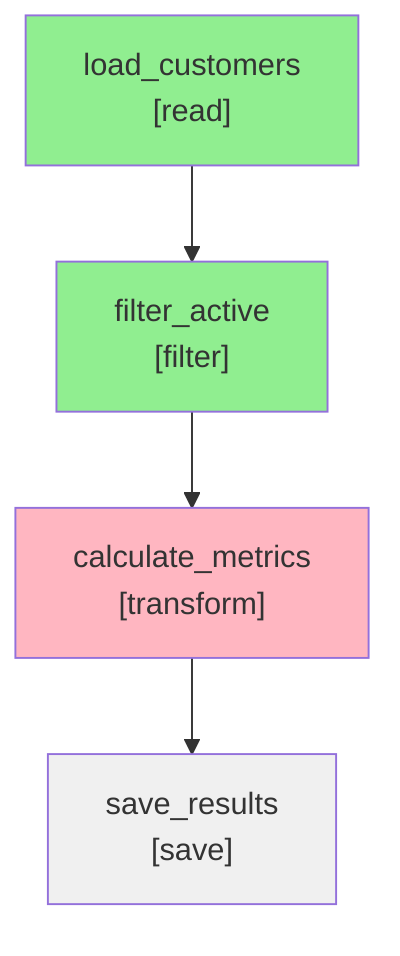
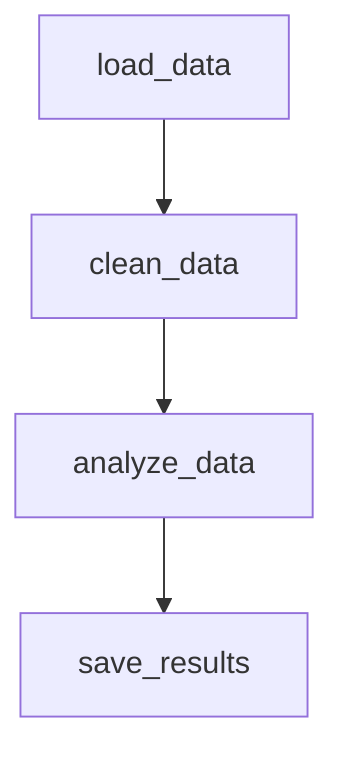

# DAG Visualization

ParquetFrame provides powerful visualization capabilities to understand workflow dependencies, debug complex pipelines, and communicate data processing flows. Generate professional diagrams in multiple formats.

## 🎨 Visualization Formats

ParquetFrame supports three visualization formats, each with unique strengths:

| Format | Best For | Output Types | Dependencies |
|--------|----------|--------------|--------------|
| **[Graphviz](#graphviz)** | Publication-ready diagrams | SVG, PNG, PDF | `graphviz` |
| **[NetworkX](#networkx)** | Interactive exploration | PNG, interactive | `networkx`, `matplotlib` |
| **[Mermaid](#mermaid)** | Documentation & web integration | Markdown, HTML | None |

## 🔧 Installation

Install visualization dependencies:

```bash
# For Graphviz support
pip install graphviz

# For NetworkX support
pip install networkx matplotlib

# All visualization dependencies
pip install parquetframe[viz]
```

## 📊 Graphviz Visualization

Professional-quality diagrams perfect for documentation and presentations.

### Usage

```bash
# Generate SVG (default)
pframe workflow pipeline.yml --visualize graphviz --viz-output workflow.svg

# Generate PNG
pframe workflow pipeline.yml --visualize graphviz --viz-output workflow.png --viz-format png

# Generate PDF for documents
pframe workflow pipeline.yml --visualize graphviz --viz-output workflow.pdf --viz-format pdf
```

### Features

- **Professional Layout**: Automatic hierarchical arrangement
- **Status Colors**: Color-coded steps based on execution status
- **Rich Metadata**: Step types, execution times, memory usage
- **Publication Ready**: Vector graphics (SVG, PDF) for scaling
- **Dependency Arrows**: Clear visualization of data flow

### Sample Output

```bash
pframe workflow customer_pipeline.yml --visualize graphviz --viz-output dag.svg
```

Generated diagram shows:
- **Green nodes**: Successfully completed steps
- **Red nodes**: Failed steps
- **Blue nodes**: Currently running steps
- **Gray nodes**: Pending/not executed steps
- **Arrows**: Data dependencies between steps

### Customization

```bash
# Different layouts
pframe workflow pipeline.yml --visualize graphviz --viz-output dag.svg --layout dot
pframe workflow pipeline.yml --visualize graphviz --viz-output dag.svg --layout circo

# Custom node attributes
pframe workflow pipeline.yml --visualize graphviz --viz-output dag.svg --show-timing --show-memory
```

---

## 🕸️ NetworkX Visualization

Interactive visualizations for exploration and analysis.

### Usage

```bash
# Generate interactive visualization
pframe workflow pipeline.yml --visualize networkx --viz-output network.png

# Display interactively (opens window)
pframe workflow pipeline.yml --visualize networkx
```

### Features

- **Interactive Layouts**: Spring, circular, hierarchical layouts
- **Dynamic Exploration**: Zoom, pan, and explore large workflows
- **Programmatic Access**: Full NetworkX graph for analysis
- **Statistical Analysis**: Built-in graph metrics and analysis

### Layout Options

```bash
# Spring layout (default) - good for general use
pframe workflow pipeline.yml --visualize networkx --layout spring

# Hierarchical layout - good for sequential workflows
pframe workflow pipeline.yml --visualize networkx --layout hierarchical

# Circular layout - good for cyclic patterns
pframe workflow pipeline.yml --visualize networkx --layout circular
```

### Advanced Usage

Access the underlying NetworkX graph programmatically:

```python
from parquetframe.workflow_visualization import WorkflowVisualizer
import yaml

# Load workflow
with open('pipeline.yml') as f:
    workflow = yaml.safe_load(f)

# Create visualizer
visualizer = WorkflowVisualizer()
G = visualizer.create_dag_from_workflow(workflow)

# Analyze graph properties
print(f"Nodes: {G.number_of_nodes()}")
print(f"Edges: {G.number_of_edges()}")
print(f"Is DAG: {nx.is_directed_acyclic_graph(G)}")

# Find critical path
import networkx as nx
longest_path = nx.dag_longest_path(G)
print(f"Critical path: {longest_path}")
```

---

## 🧜‍♀️ Mermaid Visualization

Text-based diagrams perfect for documentation and version control.

### Usage

```bash
# Generate Mermaid code
pframe workflow pipeline.yml --visualize mermaid

# Save to file
pframe workflow pipeline.yml --visualize mermaid --viz-output workflow.md
```

### Features

- **Version Control Friendly**: Text-based format
- **Documentation Integration**: Embed in Markdown, wikis
- **Web Ready**: Render in GitHub, GitLab, web browsers
- **No Dependencies**: Pure text output, no binary dependencies

### Sample Output



### Integration Examples

#### GitHub README
```markdown
## Data Pipeline Architecture


```

#### Documentation Sites
Mermaid diagrams render automatically in:
- GitHub/GitLab READMEs and wikis
- MkDocs with mermaid plugin
- Confluence and other wiki systems
- VS Code with Mermaid extensions

---

## 📈 Execution Status Visualization

Visualize workflow execution status with color coding.

### Status Colors

| Status | Graphviz | NetworkX | Mermaid | Description |
|--------|----------|----------|---------|-------------|
| **Completed** | Light Green | Green | `#90EE90` | Step executed successfully |
| **Failed** | Light Red | Red | `#FFB6C1` | Step encountered an error |
| **Running** | Sky Blue | Blue | `#87CEEB` | Step currently executing |
| **Pending** | Light Gray | Gray | `#F0F0F0` | Step not yet started |
| **Skipped** | Plum | Purple | `#DDA0DD` | Step bypassed/conditional |

### With Execution Data

```bash
# First run workflow to generate execution history
pframe workflow pipeline.yml

# Then visualize with execution status
pframe workflow pipeline.yml --visualize graphviz --viz-output execution_status.svg --show-status
```

The visualization will show:
- Completed steps in green with execution times
- Failed steps in red with error indicators
- Memory usage annotations
- Critical path highlighting

---

## 🎯 DAG Analysis Features

### Statistical Analysis

```bash
# Show DAG statistics with visualization
pframe workflow pipeline.yml --visualize mermaid --show-stats
```

**Output includes:**
```
[STATS] Workflow DAG Statistics:
  • Total Steps: 6
  • Dependencies: 5
  • Is Valid DAG: True
  • Longest Path: 4
  • Complexity: 0.83
  • Step Types: {'read': 2, 'filter': 1, 'transform': 1, 'save': 2}
```

### Complexity Metrics

- **Node Count**: Total number of workflow steps
- **Edge Count**: Total number of dependencies
- **Complexity Ratio**: Edges/Nodes (higher = more interconnected)
- **Longest Path**: Maximum dependency chain length
- **Parallelization Potential**: Steps that can run concurrently

### Issue Detection

The visualizer automatically detects potential problems:

- **Cycles**: Circular dependencies (invalid DAG)
- **Isolated Nodes**: Steps with no dependencies
- **Bottlenecks**: Steps with many dependents
- **Dead Ends**: Steps that don't contribute to outputs

```bash
# Example with issues detected
pframe workflow complex_pipeline.yml --visualize graphviz --viz-output analysis.svg

[STATS] Workflow DAG Statistics:
  • Total Steps: 8
  • Dependencies: 9
  • Is Valid DAG: False ⚠️
  • Issues: ['Workflow contains cycles', 'Isolated steps: [orphan_step]']
```

---

## 🔧 Advanced Customization

### Programmatic Visualization

Full control over visualization appearance:

```python
from parquetframe.workflow_visualization import WorkflowVisualizer
import yaml

# Load workflow
with open('pipeline.yml') as f:
    workflow = yaml.safe_load(f)

# Create visualizer with custom options
visualizer = WorkflowVisualizer()

# Customize Graphviz output
dot_source = visualizer.visualize_with_graphviz(
    workflow,
    output_path=None,  # Return source instead of saving
    format='svg'
)

# Modify the DOT source for custom styling
custom_dot = dot_source.replace(
    'node [shape=box]',
    'node [shape=ellipse, style="rounded,filled"]'
)

# Save customized version
with open('custom_workflow.dot', 'w') as f:
    f.write(custom_dot)
```

### Custom Node Styling

```python
# Define custom colors based on step properties
def get_step_color(step_config):
    step_type = step_config.get('type', 'unknown')
    color_map = {
        'read': '#E6F3FF',      # Light blue
        'filter': '#FFE6E6',    # Light red
        'transform': '#E6FFE6', # Light green
        'save': '#F0E6FF',      # Light purple
    }
    return color_map.get(step_type, '#F0F0F0')

# Apply custom styling
for step in workflow['steps']:
    step['_color'] = get_step_color(step)
```

---

## 🎨 Use Cases and Examples

### 1. Documentation and Communication

**Use Case**: Documenting data pipeline architecture for stakeholders.

```bash
# Generate clean documentation diagram
pframe workflow etl_pipeline.yml \
  --visualize graphviz \
  --viz-output docs/pipeline_architecture.svg \
  --viz-format svg \
  --clean
```

**Best For**: Technical documentation, architecture reviews, stakeholder presentations.

### 2. Debugging Complex Workflows

**Use Case**: Understanding failure patterns in complex pipelines.

```bash
# Visualize failed execution with details
pframe workflow complex_pipeline.yml \
  --visualize networkx \
  --viz-output debug_analysis.png \
  --show-status \
  --show-timing
```

**Best For**: Debugging failures, optimizing performance, identifying bottlenecks.

### 3. Version Control Integration

**Use Case**: Track workflow changes in git repositories.

```bash
# Generate text-based diagram for version control
pframe workflow pipeline.yml \
  --visualize mermaid \
  --viz-output docs/pipeline.md

# Commit to version control
git add docs/pipeline.md
git commit -m "Update pipeline diagram"
```

**Best For**: Change tracking, code reviews, collaborative development.

### 4. Performance Analysis

**Use Case**: Analyzing execution patterns across multiple runs.

```python
# Generate visualizations for multiple executions
from parquetframe.workflow_history import WorkflowHistoryManager
from parquetframe.workflow_visualization import WorkflowVisualizer

manager = WorkflowHistoryManager()
visualizer = WorkflowVisualizer()

# Get recent executions
recent_executions = manager.list_execution_records("Data Pipeline")[:5]

# Generate visualization for each execution
for i, hist_file in enumerate(recent_executions):
    execution = manager.load_execution_record(hist_file)

    # Create visualization with execution data
    output_path = f"analysis/execution_{i+1}.svg"
    visualizer.visualize_with_graphviz(
        workflow,
        execution_data=execution,
        output_path=output_path
    )
```

**Best For**: Performance optimization, trend analysis, capacity planning.

---

## 🎯 Best Practices

### Choosing the Right Format

- **Graphviz**: Professional presentations, documentation, publications
- **NetworkX**: Interactive analysis, large workflows, research
- **Mermaid**: Documentation websites, version control, collaboration

### Workflow Design for Visualization

- **Clear Naming**: Use descriptive step names
- **Logical Grouping**: Group related steps together
- **Consistent Patterns**: Follow naming conventions
- **Dependency Clarity**: Make data flow obvious

### Performance Considerations

- **Large Workflows**: Use NetworkX for workflows with >50 steps
- **Complex Dependencies**: Graphviz handles complex layouts well
- **Real-time Updates**: Mermaid is fastest for frequent regeneration
- **File Formats**: SVG for web, PDF for documents, PNG for presentations

### Integration Tips

- **CI/CD**: Automatically generate diagrams on workflow changes
- **Documentation**: Keep diagrams up-to-date with workflow changes
- **Monitoring**: Use execution status visualization for monitoring dashboards
- **Training**: Use visualizations for team onboarding and training
