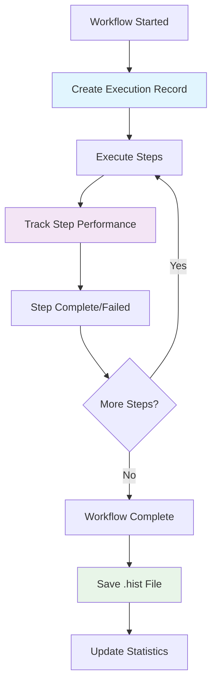

# History & Analytics

ParquetFrame automatically tracks all workflow executions, providing comprehensive analytics and performance monitoring capabilities. Monitor success rates, identify bottlenecks, and optimize your data processing pipelines.

## 📊 Execution Tracking

Every workflow execution is automatically tracked and stored in `.hist` files containing:

- **Execution Metadata**: ID, workflow name, start/end times, status
- **Step-Level Details**: Individual step performance and outcomes
- **Performance Metrics**: Duration, memory usage, data volume
- **Error Information**: Detailed failure context and stack traces
- **Environment Data**: Working directory, variables, configuration

### Execution Lifecycle



## 📈 Performance Analytics

### Execution Statistics

View aggregate statistics across all workflow runs:

```bash
# Overall statistics
pframe workflow-history --stats

# Statistics for specific workflow
pframe workflow-history --workflow-name "Data Pipeline" --stats
```

**Metrics Tracked:**

| Metric | Description | Use Case |
|--------|-------------|----------|
| **Total Executions** | Number of workflow runs | Adoption tracking |
| **Success Rate** | Percentage of successful runs | Reliability monitoring |
| **Average Duration** | Mean execution time | Performance baseline |
| **Peak Memory** | Maximum memory usage | Resource planning |
| **Step Success Rates** | Per-step reliability | Bottleneck identification |

### Performance Trends

```bash
# View recent execution details
pframe workflow-history --details --limit 10

# Filter by status to analyze failures
pframe workflow-history --status failed --details
```

### Sample Analytics Output

```
Workflow Statistics - Customer Data Pipeline
┏━━━━━━━━━━━━━━━━━━━━━┳━━━━━━━━━━━━━━━━┓
┃ Metric              ┃ Value          ┃
┡━━━━━━━━━━━━━━━━━━━━━╇━━━━━━━━━━━━━━━━┩
│ Total Executions    │ 47             │
│ Successful          │ 44             │
│ Failed              │ 3              │
│ Success Rate        │ 93.6%          │
│ Avg Duration        │ 4.23s          │
│ Total Duration      │ 198.81s        │
└─────────────────────┴────────────────┘

Performance Trends:
• Best execution: 2.15s (2024-01-20)
• Worst execution: 8.97s (2024-01-15)
• Memory usage: 25-85MB (avg: 45MB)
• Most common failure: Data validation error (2/3)
```

## 🔍 Step-Level Analytics

### Individual Step Performance

Each step execution includes detailed metrics:

```yaml
Step: load_customers (read)
├── Status: completed
├── Duration: 1.23s
├── Memory: 45.2MB
├── Input: customers.parquet (2.1MB)
├── Output: 50,000 rows
├── Backend: pandas
└── Metrics:
    ├── Read throughput: 40.7k rows/sec
    ├── Memory efficiency: 22.5 bytes/row
    └── I/O time: 0.34s (27.6% of total)
```

### Step Success Analysis

Identify which steps are most prone to failure:

```bash
# Detailed step analysis
pframe workflow-history --workflow-name "ETL Pipeline" --details
```

**Common Step Issues:**

| Step Type | Common Failures | Mitigation |
|-----------|-----------------|------------|
| **read** | File not found, permission errors | Validate input paths |
| **filter** | Query syntax errors, type mismatches | Test queries with sample data |
| **groupby** | Memory errors on large datasets | Use Dask backend, optimize grouping |
| **transform** | Function errors, missing dependencies | Validate custom functions |
| **save** | Disk space, permission errors | Check storage capacity |

## 🗂️ History Management

### Storage Location

History files are stored in `~/.parquetframe/history/` by default:

```
~/.parquetframe/history/
├── customer_pipeline_1698765425_a1b2c3d4.hist
├── etl_workflow_1698765890_b2c3d4e5.hist
├── ml_training_1698766234_c3d4e5f6.hist
└── data_cleanup_1698766578_d4e5f6g7.hist
```

### History File Format

Each `.hist` file contains JSON data with execution details:

```json
{
  "workflow_name": "Customer Data Pipeline",
  "workflow_file": "customer_pipeline.yml",
  "execution_id": "customer_pipeline_1698765425_a1b2c3d4",
  "start_time": "2024-01-15T14:30:25.123456",
  "end_time": "2024-01-15T14:30:29.876543",
  "duration_seconds": 4.753,
  "status": "completed",
  "variables": {"region": "US", "min_age": 21},
  "working_directory": "/Users/analyst/projects/data",
  "peak_memory_usage_mb": 45.2,
  "steps": [
    {
      "name": "load_customers",
      "step_type": "read",
      "status": "completed",
      "start_time": "2024-01-15T14:30:25.234567",
      "end_time": "2024-01-15T14:30:26.467890",
      "duration_seconds": 1.233,
      "input_datasets": ["customers.parquet"],
      "output_datasets": ["customers"],
      "memory_usage_mb": 45.2,
      "metrics": {
        "rows_processed": 50000,
        "file_size_mb": 2.1
      }
    }
  ]
}
```

### Cleanup and Maintenance

Manage history file storage:

```bash
# Clean up files older than 30 days
pframe workflow-history --cleanup 30

# Clean up files older than 7 days
pframe workflow-history --cleanup 7

# View cleanup results
pframe workflow-history --cleanup 30
# [SUCCESS] Cleaned up 12 history files older than 30 days
```

## 📊 Advanced Analytics

### Custom Analytics Queries

Access history data programmatically:

```python
from parquetframe.workflow_history import WorkflowHistoryManager

# Initialize manager
manager = WorkflowHistoryManager()

# Get all execution records
hist_files = manager.list_execution_records()

# Load and analyze specific execution
execution = manager.load_execution_record(hist_files[0])

print(f"Workflow: {execution.workflow_name}")
print(f"Duration: {execution.duration_seconds:.2f}s")
print(f"Steps: {len(execution.steps)}")
print(f"Success rate: {execution.success_count/len(execution.steps):.1%}")
```

### Performance Optimization Insights

#### Memory Usage Analysis

```python
# Analyze memory usage patterns
memory_usage = []
for hist_file in manager.list_execution_records("Data Pipeline"):
    execution = manager.load_execution_record(hist_file)
    memory_usage.append({
        'execution_id': execution.execution_id,
        'peak_memory': execution.peak_memory_usage_mb,
        'duration': execution.duration_seconds,
        'step_count': len(execution.steps)
    })

# Identify memory-intensive executions
high_memory = [e for e in memory_usage if e['peak_memory'] > 100]
```

#### Duration Trend Analysis

```python
# Track performance trends over time
import pandas as pd
from datetime import datetime

duration_data = []
for hist_file in manager.list_execution_records("ETL Pipeline"):
    execution = manager.load_execution_record(hist_file)
    duration_data.append({
        'date': execution.start_time.date(),
        'duration': execution.duration_seconds,
        'success': execution.status == 'completed'
    })

df = pd.DataFrame(duration_data)
print(df.groupby('date').agg({
    'duration': ['mean', 'min', 'max'],
    'success': 'mean'
}))
```

### Failure Pattern Analysis

```python
# Analyze failure patterns
failures = []
for hist_file in manager.list_execution_records():
    execution = manager.load_execution_record(hist_file)
    if execution.status == 'failed':
        failed_steps = [s for s in execution.steps if s.status == 'failed']
        for step in failed_steps:
            failures.append({
                'workflow': execution.workflow_name,
                'step_name': step.name,
                'step_type': step.step_type,
                'error': step.error_message
            })

# Most common failure points
import collections
step_failures = collections.Counter(f"{f['step_type']}:{f['step_name']}" for f in failures)
print("Most common failure points:")
for step, count in step_failures.most_common(5):
    print(f"  {step}: {count} failures")
```

## 🚨 Monitoring and Alerts

### Success Rate Monitoring

Monitor workflow reliability:

```bash
#!/bin/bash
# Simple monitoring script

WORKFLOW_NAME="Critical ETL Pipeline"
MIN_SUCCESS_RATE=95

# Get success rate
STATS=$(pframe workflow-history --workflow-name "$WORKFLOW_NAME" --stats)
SUCCESS_RATE=$(echo "$STATS" | grep "Success Rate" | grep -oE "[0-9.]+")

# Check if below threshold
if (( $(echo "$SUCCESS_RATE < $MIN_SUCCESS_RATE" | bc -l) )); then
    echo "ALERT: $WORKFLOW_NAME success rate ($SUCCESS_RATE%) below threshold ($MIN_SUCCESS_RATE%)"
    # Send alert notification
    # curl -X POST webhook_url -d "Workflow alert: Low success rate"
fi
```

### Performance Degradation Detection

Track performance regressions:

```bash
#!/bin/bash
# Performance monitoring script

WORKFLOW_NAME="Data Processing Pipeline"
RECENT_RUNS=10
BASELINE_DURATION=5.0

# Get recent execution times
RECENT_TIMES=$(pframe workflow-history \
    --workflow-name "$WORKFLOW_NAME" \
    --limit $RECENT_RUNS \
    --details | grep "Duration:" | grep -oE "[0-9.]+")

# Calculate average
AVG_DURATION=$(echo "$RECENT_TIMES" | awk '{sum+=$1} END {print sum/NR}')

# Check for performance regression
if (( $(echo "$AVG_DURATION > $BASELINE_DURATION * 1.5" | bc -l) )); then
    echo "ALERT: Performance degradation detected"
    echo "Average duration: ${AVG_DURATION}s (baseline: ${BASELINE_DURATION}s)"
fi
```

## 🎯 Best Practices

### History Management

- **Regular Cleanup**: Use `--cleanup` to manage disk space
- **Retention Policy**: Keep 30-90 days of history for trend analysis
- **Backup Critical History**: Archive important execution records

### Performance Monitoring

- **Baseline Establishment**: Track initial performance metrics
- **Trend Analysis**: Monitor performance over time
- **Proactive Alerts**: Set up monitoring for critical workflows

### Troubleshooting Workflows

1. **Check Recent Failures**: `pframe workflow-history --status failed --details`
2. **Compare Successful Runs**: Look for differences in successful vs failed executions
3. **Step-by-Step Analysis**: Identify which steps are failing most frequently
4. **Resource Monitoring**: Check memory usage patterns and duration trends
5. **Validation Testing**: Use `--validate` to catch issues before execution

### Data-Driven Optimization

- **Identify Bottlenecks**: Focus on slowest steps for optimization
- **Memory Optimization**: Monitor peak memory usage for large datasets
- **Backend Selection**: Use analytics to choose optimal pandas/Dask thresholds
- **Resource Planning**: Use historical data for capacity planning
